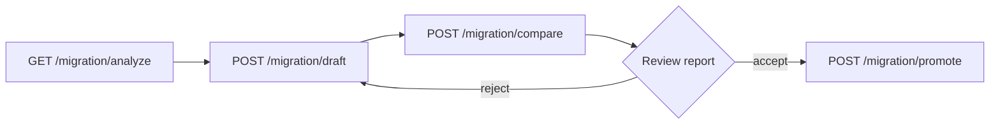

# Migration Workbench Usage

Operational guide for the V1 → V2 migration APIs added in `data-generator-service`.

**Base path:** `/template` (prepend your service host and context path, e.g. `http://localhost:8080/template`).

**Inventory file:** `docs/migration/scenario-inventory.yaml` (updated automatically after compare/promote when the template id matches `db-{id}`).

**Reports:** `docs/migration/reports/`

## Recommended workflow



1. **Analyze** — scenario family, wave, blockers, suggested classification path.
2. **Draft** — generate V2 YAML/JSON in memory (or persist via existing template update flows).
3. **Compare** — dual-run V1 vs V2, write markdown report, update inventory.
4. **Promote** — after human review, persist validated V2 on the same `TemplatePO`.

## API examples

Replace `{id}` with the database template id (e.g. `42`). Use `curl` or any HTTP client.

### 1. Analyze

```bash
curl -s "http://localhost:8080/template/migration/analyze/42"
```

Check `suggestedClass`, `blockers`, `recommendedPath` (`sql`, `sql_udf`, `compatibility_only`, etc.).

### 2. Build draft (no persist)

```bash
curl -s -X POST "http://localhost:8080/template/migration/draft/42"
```

- JDBC / query-source templates: sources become `QuerySourceVO`; single large JDBC may include `executionPolicy.mode: CHUNKED`.
- Simple iterator templates: `IteratorSourceVO` + `SELECT * FROM input` + console sink.

To persist the draft manually, save the returned body to `contentYaml` / `contentJson` on the template entity (promote does this after validation).

### 3. Compare (dual-run)

```bash
curl -s -X POST "http://localhost:8080/template/migration/compare/42" \
  -H "Content-Type: application/json" \
  -d "{\"sampleSize\":500,\"preferChunked\":true}"
```

Optional body fields:

| Field | Default | Meaning |
|-------|---------|---------|
| `sampleSize` | 500 | Rows sampled for field match rate |
| `keyColumns` | null | Intersection of keys per row when null |
| `preferChunked` | false | Hint for V2 runner policy when resolving draft |

Response includes `classification` (`EXACT`, `APPROXIMATE`, `BLOCKED`, …), `sampleMatchRate`, `v1RowCount`, `v2RowCount`, `planExplain` (execution shape, Calcite validation, V1/V2 diff notes), and `reportPath` under `docs/migration/reports/`.

### 3b. Batch compare (catalog sweep)

```bash
curl -s -X POST "http://localhost:8080/template/migration/compare/batch" \
  -H "Content-Type: application/json" \
  -d "{\"refreshInventoryFirst\":true,\"maxTemplates\":50,\"skipCompatibilityOnly\":true}"
```

| Field | Default | Meaning |
|-------|---------|---------|
| `refreshInventoryFirst` | true | Merge new `db-*` rows before comparing |
| `maxTemplates` | 50 | Safety cap per request |
| `skipCompatibilityOnly` | true | Skip inventory rows marked compatibility-only |
| `compareOptions` | null | Same fields as single compare (`sampleSize`, `keyColumns`, …) |

Returns `comparedCount`, `skippedCount`, `failedCount`, and per-template `items[]`. See `docs/migration/blocked-dual-run-runbook.md` when `failedCount > 0`.

Optional nightly job: set `pci.data.generator.migration.batch-compare.scheduled-enabled: true` (off by default).

### 4. Promote

Only after reviewing the compare report.

```bash
curl -s -X POST "http://localhost:8080/template/migration/promote/42"
```

Runs `TemplateV2Validator`, writes V2 content to the template, updates inventory. **V1 YAML is not deleted** (compatibility with rollback notes in inventory).

## Backlog and business sign-off (P3)

```bash
curl -s "http://localhost:8080/template/migration/backlog?filter=pending_signoff"
curl -s "http://localhost:8080/template/migration/signoff-status"
curl -s -X POST "http://localhost:8080/template/migration/inventory/regression-v1-constant-five-rows/signoff" \
  -H "Content-Type: application/json" \
  -d '{"approved":true,"approvedBy":"owner@example.com","notes":"Wave 1 synthetic approved"}'
```

Backlog filters: `all`, `ready`, `blocked`, `compatibility_only`, `needs_compare`, `pending_signoff`.

See `docs/migration/p3-business-signoff-checklist.md`.

## Inventory summary

```bash
curl -s "http://localhost:8080/template/migration/summary"
```

Returns totals, `byClassification`, `byScenarioFamily`, `byWave`, `readyToPromote`, `blocked`, and `compatibilityOnly` counts.

## Inventory list and refresh

List committed + merged inventory rows:

```bash
curl -s "http://localhost:8080/template/migration/inventory"
```

Merge **new** V1 templates from the database (`db-{templateId}` ids only; existing ids are skipped):

```bash
curl -s -X POST "http://localhost:8080/template/migration/inventory/refresh"
```

Response fields: `addedCount`, `totalCount`, `inventoryPath`, `persisted` (whether YAML was rewritten).

Regression fixtures are seeded from `classpath:migration/regression/*.yaml` via `MigrationInventorySeeder` when building DB entries; the committed file under `docs/migration/scenario-inventory.yaml` is updated on refresh when new templates appear.

## Classification quick reference

| Result | Meaning |
|--------|---------|
| `EXACT` | Counts and sample match ≥ 99.9%, no material warnings |
| `APPROXIMATE` | Acceptable with documented warnings (e.g. `SourcePolicyVO`) |
| `ADAPTED` | Cleaner V2 shape, reviewer sign-off expected |
| `COMPATIBILITY_ONLY` | Stay on V1 (pause, shared, JavaScript, etc.) |
| `BLOCKED` | Sample match &lt; 95% or failed compare — do not promote |

See `docs/migration/retirement-readiness.md` for gate checklist.

## Related

- `docs/superpowers/specs/2026-05-19-v1-migration-dual-run-design.md`
- `docs/template-v2-jdbc-chunked-execution-guide.md` — CHUNKED execution for large JDBC exports
- `docs/migration/compatibility-only-templates.md`
