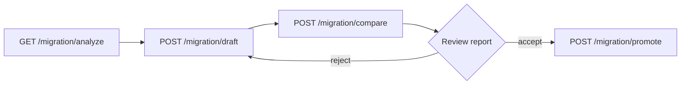

# Migration Workbench Usage

Operational guide for the V1 → V2 migration APIs added in `data-generator-service`.

**Base path:** `/template` (prepend your service host and context path, e.g. `http://localhost:8080/template`).

**Inventory file:** `docs/migration/scenario-inventory.yaml` (updated automatically after compare/promote when the template id matches `db-{id}`).

**Reports:** `docs/migration/reports/`

## Recommended workflow



1. **Analyze** — scenario family, wave, blockers, suggested classification path.
2. **Draft** — generate V2 YAML/JSON in memory (or persist via existing template update flows).
3. **Compare** — dual-run V1 vs V2, write markdown report, update inventory.
4. **Promote** — after human review, persist validated V2 on the same `TemplatePO`.

## API examples

Replace `{id}` with the database template id (e.g. `42`). Use `curl` or any HTTP client.

### 1. Analyze

```bash
curl -s "http://localhost:8080/template/migration/analyze/42"
```

Check `suggestedClass`, `blockers`, `recommendedPath` (`sql`, `sql_udf`, `compatibility_only`, etc.).

### 2. Build draft (no persist)

```bash
curl -s -X POST "http://localhost:8080/template/migration/draft/42"
```

- JDBC / query-source templates: sources become `QuerySourceVO`; single large JDBC may include `executionPolicy.mode: CHUNKED`.
- Simple iterator templates: `IteratorSourceVO` + `SELECT * FROM input` + console sink.

To persist the draft manually, save the returned body to `contentYaml` / `contentJson` on the template entity (promote does this after validation).

### 3. Compare (dual-run)

```bash
curl -s -X POST "http://localhost:8080/template/migration/compare/42" \
  -H "Content-Type: application/json" \
  -d "{\"sampleSize\":500,\"preferChunked\":true}"
```

Optional body fields:

| Field | Default | Meaning |
|-------|---------|---------|
| `sampleSize` | 500 | Rows sampled for field match rate |
| `keyColumns` | null | Intersection of keys per row when null |
| `preferChunked` | false | Hint for V2 runner policy when resolving draft |

Response includes `classification` (`EXACT`, `APPROXIMATE`, `BLOCKED`, …), `sampleMatchRate`, `v1RowCount`, `v2RowCount`, and `reportPath` under `docs/migration/reports/`.

### 4. Promote

Only after reviewing the compare report.

```bash
curl -s -X POST "http://localhost:8080/template/migration/promote/42"
```

Runs `TemplateV2Validator`, writes V2 content to the template, updates inventory. **V1 YAML is not deleted** (compatibility with rollback notes in inventory).

## Refresh inventory from database

In tests or a future admin task, merge all V1 templates from the DB into `scenario-inventory.yaml`:

```java
migrationInventoryService.refreshFromRepository(templateRepository);
```

Regression fixtures are seeded from `classpath:migration/regression/*.yaml` via `MigrationInventorySeeder`.

## Classification quick reference

| Result | Meaning |
|--------|---------|
| `EXACT` | Counts and sample match ≥ 99.9%, no material warnings |
| `APPROXIMATE` | Acceptable with documented warnings (e.g. `SourcePolicyVO`) |
| `ADAPTED` | Cleaner V2 shape, reviewer sign-off expected |
| `COMPATIBILITY_ONLY` | Stay on V1 (pause, shared, JavaScript, etc.) |
| `BLOCKED` | Sample match &lt; 95% or failed compare — do not promote |

See `docs/migration/retirement-readiness.md` for gate checklist.

## Related

- `docs/superpowers/specs/2026-05-19-v1-migration-dual-run-design.md`
- `docs/template-v2-jdbc-chunked-execution-guide.md` — CHUNKED execution for large JDBC exports
- `docs/migration/compatibility-only-templates.md`
