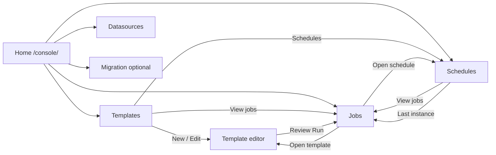

# Operator console — UI feature guide

Browser-based operator console for **Template V2** authoring, JDBC datasource administration, task execution history, cron schedules, and (optional) V1→V2 migration. The UI is a **React SPA** (`data-generator-console-web`) embedded in `data-generator-service` at `/console/*`. Console HTTP APIs live under `/api/*`; legacy REST paths (`/template/…`, `/task/…`, `/datasource/…`) remain for automation.

**UI stack:** React 19 + Vite + Ant Design + React Router + TanStack Query.  
**i18n:** English + 中文 (`data-generator-console-web/src/i18n/`).  
**Design spec:** `docs/superpowers/specs/2026-05-26-react-console-embedded-design.md`

---

## Access

| Surface | URL |
|---------|-----|
| React console | http://localhost:9876/console/ |
| Console API | http://localhost:9876/api/… |
| Legacy REST | `/template/…`, `/task/…`, `/datasource/…` |
| H2 console (dev) | http://localhost:9876/h2 |

Default HTTP port: **9876** (`application.yaml`).

### Build and run

```powershell
.\mvnw-jdk25.ps1 -pl data-generator-service -am -DskipTests package
.\mvnw-jdk25.ps1 -pl data-generator-service spring-boot:run
```

### Local UI development (Vite)

Run Spring Boot on **9876**, then:

```powershell
cd data-generator-console-web
npm install
npm run dev
```

Open http://localhost:5173/console/ — Vite proxies `/api` to the backend.

---

## Runtime flags (navbar + home)

`GET /api/console/runtime` returns:

| Field | Config property | Default | UI meaning |
|-------|-----------------|---------|------------|
| `v1ExecutionEnabled` | `data.generator.v1-execution.enabled` | **false** | V1 template runs via `/task/run` |
| `scheduleEnabled` | `data.generator.schedule.enabled` | false | Cron poller evaluates `task_schedule` |
| `distributedEnabled` | `data.generator.distributed.enabled` | false | Queue-backed multi-node execution |

The **home page** shows these flags and a four-step recommended workflow. The **navbar** shows V1 status plus optional tags when schedule or distributed mode is on.

**V1 retirement:** V1 execution is **off by default**. Only Template V2 should be created and run in normal operations. To re-enable legacy V1 runs (emergency only): `data.generator.v1-execution.enabled: true`.

**Migration UI:** Hidden unless the console build sets `VITE_ENABLE_MIGRATION=true` (nav item + editor Migration tab).

---

## Navigation map



| Route | Purpose |
|-------|---------|
| `/console/` | Home — runtime status, workflow, area cards |
| `/console/templates` | Template catalog |
| `/console/templates/new` | New V2 wizard |
| `/console/templates/{id}` | Edit template (`?tab=` for active tab) |
| `/console/datasources` | JDBC admin |
| `/console/jobs` | Execution history (`?templateId=`, `?triggerType=`) |
| `/console/jobs/{instanceId}` | Single run detail |
| `/console/schedules` | Cron CRUD (`?templateId=`, `?scheduleId=`) |
| `/console/migration` | Global migration dashboard (optional) |

---

## Recommended operator workflows

### A — First template end-to-end

1. **Datasources** → add JDBC (use **Common JDBC driver** preset; URL template fills automatically when switching preset).
2. **Templates** → **New template** → complete General / Sources / Transform / Sinks / Execution.
3. **Review** tab → **Validate** → **Save** → **Publish** (status `PUBLISHED` required when `governance.requirePublishedForTaskRun=true`).
4. **Run** from Review or template list → redirected to **Job detail**.
5. Confirm status `SUCCESS` and structured run report on detail page.

### B — Scheduled runs

1. Publish template (step A).
2. Set on server: `data.generator.schedule.enabled: true`.
3. **Schedules** → **New schedule** → pick published template, set Spring six-field cron (e.g. `0 0 2 * * *`).
4. After trigger, open **Last instance** link or **Jobs** filtered by `triggerType=SCHEDULED`.
5. From job detail, **Open schedule** jumps to `/schedules?scheduleId=…` (row highlighted).

### C — Investigate a failed run

1. **Jobs** → filter by template id if needed → **Detail**.
2. Read status tag, **Run report** (sources/transform/sinks metrics), error samples, raw metrics JSON.
3. If distributed mode: check **Distributed job** block (worker, lease, attempts).
4. **Open template** to fix draft; re-run from Review.

### D — Cross-module navigation (linkage)

| From | Action | To |
|------|--------|-----|
| Template list | Schedules | `/schedules?templateId=` |
| Template list | View jobs | `/jobs?templateId=` |
| Schedule row | View jobs | `/jobs?templateId=&triggerType=SCHEDULED` |
| Schedule row | Last instance | `/jobs/{instanceId}` |
| Job list | Template name | `/templates/{id}` |
| Job list | Schedule `#id` (scheduled runs) | `/schedules?scheduleId=` |
| Job detail | Open template / Open schedule | Template editor / Schedules |

---

## Page reference

### Home (`/console/`)

- **Server capabilities** — V1 / schedule / distributed flags from runtime API.
- **Recommended workflow** — four vertical steps (datasource → template → run/schedule → monitor).
- **Area cards** — short description per module; migration card only when `VITE_ENABLE_MIGRATION=true`.

### Shared UI patterns (2026-06)

- **Breadcrumbs** — list and detail pages use `ConsolePageHeader` (home → section → item).
- **Field help (`?`)** — key wizard fields (sources, sinks, transform, workflow, execution) show tooltips.
- **Localized dropdown labels** — enum values (writer type, execution mode, workflow step type, transform type, etc.) use i18n labels instead of raw constants.
- **Editor tab hints** — contextual info on General (new), Sources, and Review tabs.
- **Schedules poller warning** — yellow alert when `schedule.enabled=false` on the server.
- **Template list** — client-side filter by `DRAFT` / `PUBLISHED` status; **legacy V1 templates are hidden** from the catalog.
- **Jobs** — clear URL filters; localized trigger type; schedule id link for scheduled runs.
- **Template editor** — status tag (`DRAFT` / `PUBLISHED`); updates after Publish on Review tab.
- **Schedules form** — one-click cron presets (hourly, daily, weekly, monthly) plus live next-run preview via `GET /api/console/schedules/preview?cron=…`.
- **Timestamps** — jobs and schedules use locale-aware formatting in tables and detail views.

### Templates (`/console/templates`)

| Column / control | Description |
|------------------|-------------|
| Id, name, status, archived | Catalog sort; status `DRAFT` / `PUBLISHED` |
| Filter | Name or id substring |
| Include archived | Shows soft-deleted rows |
| **New template** | Opens empty V2 scaffold |
| **Edit** | Wizard + YAML + optional Migration tab |
| **View jobs** | `/jobs?templateId=` |
| **Schedules** | `/schedules?templateId=` |
| **Run** | Starts async execution; opens job detail |
| **Archive / Restore** | Soft delete; blocked while `QUEUED`/`RUNNING` |

**API:** `GET/POST /api/templates`, archive/restore/run actions on `/api/templates/{id}/…`

### Template editor (`/console/templates/new` or `/{id}`)

**Model C:** structured wizard (primary) + collapsible **YAML advanced** panel.

| Tab | Content |
|-----|---------|
| General | Name, generator settings |
| Sources | Query (JDBC), iterator, csv/json/excel/geojson; file **upload** or **paste**; JDBC/Kafka/ES keys from editor data sources API |
| Transform | SQL or SpEL; single step or transformer chain; compute blocks may use linear or **DAG** layout |
| Sinks | CONSOLE, JDBC, KAFKA, ELASTICSEARCH with labeled writer types and cluster dropdowns |
| Execution | `executionPolicy`, chunking (labeled modes) |
| Workflow | Optional L2 steps + compute blocks (each block reuses Sources / Transform / Sinks) |
| Review | Validate, Preview, Save, Publish, Run |
| Migration | Analyze / compare / promote (optional; saved templates only) |

**V1 templates:** excluded from `GET /api/templates` catalog. Opening a V1 row in the editor returns an error with guidance to migrate or edit YAML on disk. V1 **execution** remains gated by `v1-execution.enabled` (default off).

**YAML advanced:** **Sync from form** exports the in-memory draft (`POST /api/templates/draft/yaml`); new templates auto-sync once on first open. **Reload from server** uses `GET /api/templates/{id}/yaml`.

**File sources:** `POST /api/console/uploads/file` (multipart) and `POST /api/console/uploads/inline` (JSON body) write under `{user.dir}/../uploaded-sources/` and return the absolute path for the source `path` field.

**New template fix:** route `/templates/new` uses pathname detection (not `:id` param) so scaffold loads immediately.

**API:** `/api/templates/scaffold`, `/api/templates/{id}`, editor actions under `/api/templates/{id}/draft/…` and `/api/templates/{id}/yaml`, `GET /api/console/editor-data-sources`.

Preview requires **IN_MEMORY** execution mode; CHUNKED/STREAMING templates fail with a clear error.

### Datasources (`/console/datasources`)

| Section | Description |
|---------|-------------|
| Persisted grid | Name, JDBC URL, driver class, enabled |
| Runtime keys | Union of `application.yaml` dynamic datasources + persisted rows |
| Kafka clusters | Ids from `spring.kafka.multiple.clusters` (read-only); **Copy Kafka config snippet** for `application.yaml` |
| Elasticsearch clusters | Ids from `spring.elasticsearch.multiple.clusters` (read-only); **Copy ES config snippet** |
| New / Edit | Name, URL, credentials, driver preset or custom class, optional JAR upload |
| Driver preset | Fills driver class + URL template; **switching preset always updates URL** |
| Test | Validates without save |
| Remove | Drops runtime registration and disables persisted row |

Kafka and Elasticsearch cluster ids are **not** created in the UI — add them in `application.yaml` and restart the service, then use the id as the writer `dataSourceId`.

**API:** `/api/datasources` (Console facade). Legacy: `/datasource/database/…`.

### Jobs (`/console/jobs`)

| Column / control | Description |
|------------------|-------------|
| Instance id | Sortable |
| Template | Link to editor |
| Kind | V1 / V2 |
| Trigger | Localized Manual / Scheduled; scheduled rows link `#scheduleId` |
| Status | Tag with color |
| Finished | Timestamp |
| Filters | Template id, trigger type (`MANUAL` / `SCHEDULED`) |
| Polling | Auto 2s refresh while any row is `QUEUED` or `RUNNING` |
| Distributed block | Shown when `distributed.enabled`; queue depth + active workers |

Statuses: `QUEUED`, `RUNNING`, `SUCCESS`, `FAILED`, `CANCELLED`, `PAUSED`.

**API:** `GET /api/console/jobs`, `GET /api/console/jobs/{instanceId}`, cancel/resume actions.

### Job detail (`/console/jobs/{instanceId}`)

- Status, template, trigger (localized), schedule id, row count, timestamps.
- **Distributed job** and **partition metrics** when applicable.
- **Run report** — per-stage rows processed / duration / errors.
- Raw metrics or error message block.
- Actions: Back, Open template, Open schedule (scheduled runs), Refresh, Cancel (active), Resume (`PAUSED`).

Polls every 2s until terminal status.

### Schedules (`/console/schedules`)

Requires server `data.generator.schedule.enabled=true` for actual triggers; UI always allows CRUD.

| Column | Description |
|--------|-------------|
| Template | Link to editor |
| Cron | Spring six-field expression |
| Enabled | On/off |
| Next / Last trigger | Computed timestamps |
| Last instance | Link to job detail |
| Actions | Edit, View jobs, Delete |

**Deep link:** `?scheduleId=` highlights row and syncs template filter (does not auto-open edit dialog).

**API:** `/api/console/schedules` (GET list, POST create, PUT/DELETE by id). RBAC: GET → `JOB_READ`, mutations → `TEMPLATE_RUN`.

### Migration (optional)

**Per-template tab** (editor): analyze, draft, compare, sign-off, promote.  
**Global** `/console/migration`: inventory summary + backlog grid.

See `docs/migration/orchestration-retirement-boundary.md` for W3 `COMPATIBILITY_ONLY` policy.

---

## Backend API summary

| UI area | Primary console API | Legacy REST |
|---------|---------------------|-------------|
| Runtime flags | `GET /api/console/runtime` | — |
| Editor data sources | `GET /api/console/editor-data-sources` (JDBC + Kafka + ES ids) | — |
| JDBC names (legacy) | `GET /api/console/jdbc-names` | — |
| Source file upload | `POST /api/console/uploads/file`, `POST /api/console/uploads/inline` | — |
| Templates | `/api/templates`, `/api/templates/{id}/…` | `/template/…` |
| Datasources | `/api/datasources` | `/datasource/database/…` |
| Jobs | `/api/console/jobs` | `POST /task/run/{id}` |
| Distributed metrics | `/api/console/distributed/metrics` | — |
| Schedules | `/api/console/schedules`, `GET /api/console/schedules/preview?cron=` | — |
| Migration | `/api/migration/…` | — |

Controllers: `ConsoleTemplateController`, `ConsoleTemplateEditorController`, `ConsoleTemplateEditorActionsController`, `ConsoleUploadController`, `ConsoleDataSourceController`, `ConsoleJobController`, `ConsoleScheduleController`, `ConsoleDistributedController`, `ConsoleRuntimeController`, `ConsoleMigrationController`.

---

## Configuration reference

```yaml
data:
  generator:
    v1-execution:
      enabled: false          # V1 run gate (default retired)
    schedule:
      enabled: false          # Cron poller
      poll-delay-ms: 60000
    distributed:
      enabled: false          # Queue-backed execution
      worker-enabled: false
      coordinator-poll-enabled: true
    governance:
      require-published-for-task-run: true
      reject-plaintext-passwords-in-templates: true
```

Distributed staging: `docs/staging-distributed-deployment.md`.

---

## Manual acceptance checklists

### Templates

1. Create V2 template with JDBC sink referencing a datasource from **Datasources**.
2. Review → Validate — no blocking errors.
3. Save and publish; row visible in catalog.
4. Archive → hidden without “Include archived”; restore works.

### Datasources

1. Add H2 datasource via MySQL/PostgreSQL preset or custom driver.
2. Switch driver preset — URL updates to template.
3. Test connection; reference name in template source/sink.

### Jobs

1. Run minimal V2 console-sink template.
2. Jobs list reaches `SUCCESS`; detail shows report.
3. Archive blocked while run is active.

### Schedules

1. Enable `schedule.enabled` on server.
2. Create schedule for published template.
3. Confirm scheduled job with `triggerType=SCHEDULED` and schedule id link.
4. Job detail → Open schedule highlights correct row.

---

## Known gaps (follow-on)

- In-console registration of Kafka / Elasticsearch clusters (today: `application.yaml` + restart only).
- Fine-grained Spring Security roles on all console routes (partial RBAC on schedules).
- W3 V2 orchestration spike (P5, deferred).

---

## Verify after changes

```powershell
.\mvnw-jdk25.ps1 -pl data-generator-service -am test
cd data-generator-console-web && npm run build
jar tf data-generator-service\target\data-generator-service-*.jar | findstr static/console/index.html
```

## Related docs

- `docs/staging-distributed-deployment.md` — C2 dual-JVM staging
- `docs/migration/staging-readiness-checklist.md` — V1 retirement M2
- `docs/migration/retirement-readiness.md` — cutover gates
