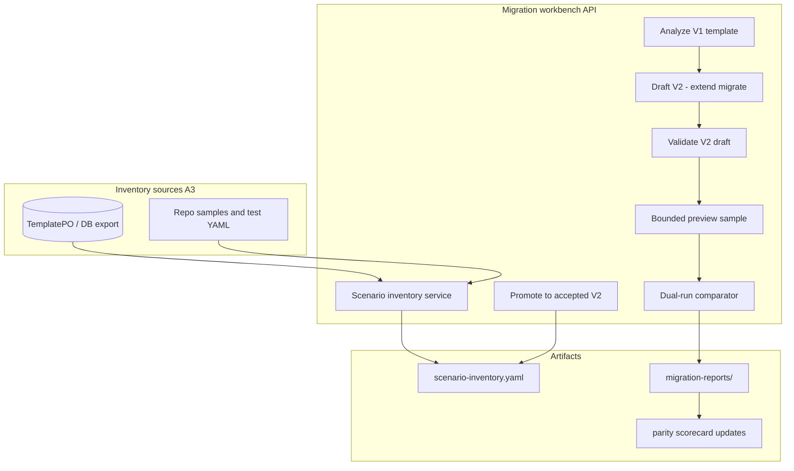

# V1 Migration and Dual-Run Acceptance Design

## Metadata

| Field | Value |
|-------|-------|
| Status | Approved (brainstorming) |
| Date | 2026-05-19 |
| Author | Gensokyo |
| Primary priority | **A** — V1 template migration and dual-run acceptance |
| Inventory sources | **A3** — database V1 templates (primary) + repository samples/tests (regression set) |

## Related documents

- `docs/template-v2-migration-program.md`
- `docs/template-v2-product-roadmap.md`
- `docs/calcite-v1-parity-scorecard.md`
- `docs/calcite-v1-v2-mapping.md`
- `docs/calcite-v1-v2-migration-examples.md`
- `docs/calcite-implementation-status.md`
- `docs/template-v2-jdbc-chunked-execution-guide.md`
- `docs/superpowers/specs/2026-05-19-jdbc-chunked-execution-design.md`

## Problem statement

Template V2 execution and JDBC chunked export are materially ahead of **migration program** delivery. The repository has query-source migration APIs, analysis warnings, and documentation, but lacks:

- a maintained **scenario inventory** spanning real DB templates and in-repo samples
- **automated dual-run comparison** (V1 vs V2) with auditable reports
- a **promotion path** from migrated draft to accepted V2 template
- **gate evidence** for retiring V1 by scenario family

Product roadmap and `template-v2-migration-program.md` define the intended program; this spec turns priority **A** into an implementable quarter plan.

## Goals

1. **Inventory** all in-scope V1 templates from **DB (primary)** and **repository samples (regression)** with scenario family, migration class, blockers, and evidence links.
2. **Migrate** Wave 1–2 template families using existing and extended service APIs (not a separate microservice).
3. **Dual-run** sensitive templates and record **exact / adapted / approximate / compatibility-only** outcomes.
4. **Update** parity scorecard and migration examples from evidence, not optimism.
5. **Defer** full explain UI, governance plane, and official non-SQL transformer until inventory shows Wave 3 blockers.

## Non-goals (this program)

- Unattended migration without human review for business templates
- Byte-for-byte parity promises where V2 intentionally simplifies the model
- Forcing orchestration-heavy V1 (pause, log, shared, iterator branching, JavaScript) into V2 SQL
- Full control-plane product (explain, dashboards) — only **minimal bounded preview** needed for compare sampling
- V1 retirement in this quarter (only **readiness gates** and evidence)

## Success criteria (quarter)

| # | Criterion |
|---|-----------|
| 1 | `docs/migration/scenario-inventory.yaml` (or equivalent) lists ≥20 templates: majority from DB export, plus repo regression set |
| 2 | ≥10 templates complete workflow: analyze → draft → validate → compare → classified outcome |
| 3 | Wave 1 scenario family has ≥5 dual-run reports referenced from inventory |
| 4 | Wave 2 (query / multi-source / large JDBC) has ≥3 dual-run reports; CHUNKED used where row volume warrants |
| 5 | `calcite-v1-parity-scorecard.md` updated for each closed gap with inventory row id |
| 6 | Published list of **compatibility-only** templates with explicit V1 retention reason |

## Current baseline

### Reuse

| Capability | Location |
|------------|----------|
| V1 → V2 query-source migrate | `TemplateController.migrateQuerySourceV2ById` |
| Migration analysis | `TemplateController.analyzeQuerySourceV2ById`, `QuerySourceMigrationAnalysisDTO` |
| Approximation warnings | `V1QuerySourceMigrationWarningAnalyzer` |
| V2 validation | `TemplateV2Validator` (+ `ExecutionShapeClassifier` for CHUNKED) |
| V1/V2 task execution | `TaskController` (template kind detection) |
| CHUNKED JDBC export | `ChunkedPipeline`, `docs/template-v2-jdbc-chunked-execution-guide.md` |
| Examples / scorecard | `calcite-v1-v2-migration-examples.md`, `calcite-v1-parity-scorecard.md` |

### Gaps

| Gap | Program step blocked |
|-----|----------------------|
| No inventory artifact | M0 |
| No compare API / report | Step 4 Compare, Gate P3 |
| Migrate path not full-template | Wave 1 iterator/faker templates |
| No promote / acceptance record | Step 5 Promote |
| Limited preview for sampling | Step 3 Validate (partial) |

## Architecture: migration workbench (service layer)

New capabilities live in **`data-generator-service`**, orchestrating **`data-generator-calcite`** runtime. No new top-level module.



### Components

#### 1. Scenario inventory (`MigrationInventoryService`)

**Purpose:** Single source of truth for migration status.

**Sources (A3):**

| Source | Role | Ingestion |
|--------|------|-----------|
| **Database** | Primary — real business templates | Export via existing `TemplateRepository` / admin API or one-off `migration-inventory-export` command; fields: id, name, content hash, detected kind (V1) |
| **Repository** | Regression — known-good shapes | Scan `data-generator-service/src/test/resources`, `samples/`, documented paths in migration examples; fixed ids like `regression-query-lookup-01` |

**Record fields (minimum):**

```yaml
- id: "db-12345"           # or regression-*
  name: "order_seed_v1"
  origin: database | repository
  scenarioFamily: synthetic | multi_source | file_conversion | ai | orchestration_legacy
  migrationClass: unclassified | exact | adapted | approximate | compatibility_only
  wave: 1 | 2 | 3 | 4
  blockers: []
  v2DraftTemplateId: null    # after migrate
  lastCompareReportId: null
  notes: ""
```

**Location:** `docs/migration/scenario-inventory.yaml` (committed, updated by tool + PR).

**Rules:**

- DB rows are never deleted from inventory when template removed in DB — mark `status: retired`.
- Regression entries must stay green in CI (compare job optional later).

#### 2. Migration analyzer (extend existing)

**Purpose:** Enrich `QuerySourceMigrationAnalysisDTO` or parallel `TemplateMigrationAnalysisDTO` for **full V1 root**, not only query-source.

**Outputs:**

- Recommended `scenarioFamily` and `wave`
- Suggested `migrationClass` pre-check (compatibility-only if pause/log/shared/JS detected)
- Blocker list (missing faker UDF, unsupported selection, etc.)
- Pointer to existing warnings from `V1QuerySourceMigrationWarningAnalyzer`
- Recommended path: `sql` | `sql_udf` | `non_sql` | `custom` | `compatibility_only`

**Implementation note:** Start by wrapping current analyze + static rules; avoid new DSL.

#### 3. Draft generator (extend `migrateQuerySourceV2`)

**Phased coverage:**

| Wave | Draft scope |
|------|-------------|
| Wave 1 | Iterator, constant/datetime, simple SQL, mapping/condition patterns, console/file sinks |
| Wave 2 | Query sources, multi-source join skeleton, multi-sink, `executionPolicy: CHUNKED` when single large JDBC query detected |
| Wave 3+ | Document blockers; do not auto-draft script-heavy templates |

Persist as today: `TemplateV2DraftVO` on same `TemplatePO` or sibling draft column per existing migrate tests.

#### 4. Bounded preview (`MigrationPreviewService`)

**Purpose:** Sample rows for compare, not full explain.

**Behavior:**

- Cap rows with `executionPolicy.previewRowLimit` or service default (100)
- Run V2 draft only (V1 preview optional later)
- Return schema + sample rows + row count estimate if cheap

**Explicitly not:** full explain plan, middle-stage transform preview (P1).

#### 5. Dual-run comparator (`MigrationCompareService`)

**Purpose:** Gate P3 evidence.

**Inputs:**

- `templateId` (V1 content from DB)
- `v2Draft` or persisted V2 YAML
- Optional compare options: `sampleSize`, `keyColumns`, `useChunked` (hint for runner)

**Execution:**

1. Run V1 pipeline via existing task/run path (same parameters / env).
2. Run V2 pipeline via `TemplateV2Runner` with resolved `EffectiveExecutionPolicy`.
3. Compare:
   - total row count (V2 may not return all rows in CHUNKED — compare sink row count or side table)
   - keyed sample: hash or field-by-field on first N rows
   - attach analyzer warnings to report

**Output:** `MigrationComparisonReport` (JSON + markdown fragment):

```json
{
  "templateId": "db-12345",
  "classification": "approximate",
  "v1RowCount": 10000,
  "v2RowCount": 10000,
  "sampleSize": 500,
  "sampleMatchRate": 0.998,
  "warnings": ["SourcePolicyVO does not replicate ONCE_RANDOM"],
  "recommendation": "accept_with_review"
}
```

**Storage:** `docs/migration/reports/{templateId}-{timestamp}.md` (committed for accepted templates) or DB blob later.

**Sensitive scenarios (mandatory dual-run):** per migration program — financial outputs, complex lookup, approximate policy, script→SQL rewrites.

#### 6. Promote (`MigrationPromoteService`)

**Purpose:** Mark template accepted as V2 after review.

**Actions:**

- Validate V2 draft
- Set inventory `migrationClass` and `v2Published: true`
- Update template record to V2-first (product decision: same id vs new id — **default: same TemplatePO id**, V1 content archived in `contentYamlV1Archive` only if column exists; otherwise inventory notes only for v1)

**Out of scope v1:** Automated rollback to V1.

## Delivery phases

### M0 — Inventory (week 1–2)

- Define `scenario-inventory.yaml` schema
- Export DB V1 templates (script or REST batch)
- Register repo regression set (≥5 entries from tests + examples)
- Classify each row: scenario family, wave, initial `migrationClass`
- Deliverable: committed inventory, no compare yet

### M1 — Dual-run core (week 3–5)

- `MigrationCompareService` + REST: `POST /api/templates/{id}/migration/compare`
- Report writer to `docs/migration/reports/`
- Wave 1: ≥5 DB templates + all regression entries compared
- Update inventory with `lastCompareReportId` and classification
- Deliverable: compare tests with H2 or fixture templates

### M2 — Draft expansion + Wave 2 (week 6–8)

- Extend draft for faker / multi-sink / CHUNKED policy injection
- Wave 2: ≥3 DB templates dual-run (large JDBC uses CHUNKED)
- Expand `calcite-v1-v2-migration-examples.md` from real inventory ids
- Deliverable: scorecard rows closed with evidence links

### M3 — Promote + gates (week 9–10)

- Promote API + inventory update
- **Compatibility-only** appendix in inventory
- **Retirement readiness** doc section: which scenario families pass P1–P3
- Deliverable: team sign-off checklist, not V1 code removal

## API sketch (REST)

| Method | Path | Purpose |
|--------|------|---------|
| GET | `/templates/{id}/migration/analysis` | Full V1 analysis (extend existing analyze) |
| POST | `/templates/{id}/migration/draft` | Generate/update V2 draft |
| POST | `/templates/{id}/migration/compare` | Dual-run + report |
| POST | `/templates/{id}/migration/promote` | Accept V2 after review |
| GET | `/migration/inventory` | List inventory (optional; YAML may suffice v1) |

Align paths with existing `TemplateController` style (`migrateQuerySourceV2ById` may remain as alias during deprecation).

## Classification rules (compare)

| Condition | `migrationClass` |
|-----------|-------------------|
| Row counts match and sample match rate ≥ 99.9%, no material warnings | `exact` |
| Business-acceptable deltas documented in warnings | `approximate` |
| V2 cleaner model, reviewers sign off in promote | `adapted` |
| Blockers or orchestration features | `compatibility_only` |
| Compare failed or sample match below threshold | `blocked` (not promoted) |

Threshold default: sample match rate &lt; 95% → `blocked` unless overridden with manual `adapted` + note.

## Relationship to other roadmap items

| Item | Relationship |
|------|----------------|
| JDBC CHUNKED | V2 arm for large exports in Wave 2 compare |
| Control plane explain | Optional later; compare uses sink counts + bounded sample |
| Non-SQL transformer | Wave 3 blocker in inventory; not required for M1 |
| Governance | P2; inventory may note `datasourceId` only |

## Testing strategy

- **Unit:** classification rules, report JSON shape, inventory merge
- **Integration:** `TemplateController` migration flow on fixture V1 YAML (existing test style)
- **Regression:** repo inventory entries must pass compare in CI (subset, fast fixtures)
- **Manual:** ≥3 real DB templates validated in test/staging environment per M2

## Risks and mitigations

| Risk | Mitigation |
|------|------------|
| DB templates contain secrets | Export redacts credentials; inventory stores ids not full YAML |
| CHUNKED compare without full `rows` in result | Compare via sink JDBC count or temp table |
| Compare flakiness (timestamps, random) | Document keys to exclude; use faker seed where applicable |
| Scope creep into full explain | Hard-gate M1 to compare + preview sample only |
| Inventory drift | PR requires inventory update when promote |

## Open decisions (resolved)

| Decision | Choice |
|----------|--------|
| Inventory sources | **A3** — DB primary, repo regression |
| Compare storage v1 | Git-tracked markdown under `docs/migration/reports/` |
| Promote same template id | Yes, unless team later requires forked id |
| CHUNKED in Wave 2 compare | Yes, when inventory marks `largeJdbcExport` |

## Spec self-review

- [x] No TBD placeholders in success criteria or phases
- [x] Consistent with `template-v2-migration-program.md` waves and gates
- [x] A3 reflected in inventory component
- [x] Scoped for single implementation plan (service + docs + tests)
- [x] Does not contradict JDBC chunked spec
