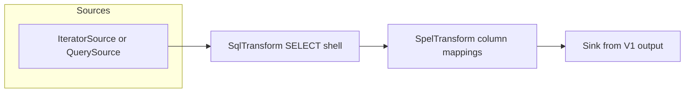

# SCRIPT → SpEL Draft Migration Design

## Metadata

| Field | Value |
|-------|-------|
| Status | Implemented (2026-05-22); plan: `docs/superpowers/plans/2026-05-21-script-spel-draft-migration.md` |
| Date | 2026-05-21 |
| Driver | Constraint **D** — SCRIPT-heavy templates block honest V1 retirement timeline |
| Scope choice | **2b** — synthetic **and** JDBC / `multi_source` built-in templates |
| Depends on | `SpelTransformVO` / `SpelTransformFactory` (runtime delivered on `feature-4.0`); `V1TemplateMigrationAnalyzer` `PATH_SPEL` |
| Parent | `docs/superpowers/specs/2026-05-21-v1-retirement-alignment-design.md` (WS1 completion) |
| Related | `docs/template-v2-transformer-strategy.md`, `docs/migration/compatibility-only-templates.md`, `docs/superpowers/specs/2026-05-21-v1-retirement-deferred-ops-design.md` |

## Problem statement

On `feature-4.0`, **WS1 is half-delivered**:

- **Runtime:** `SpelTransformVO` + `SpelTransformFactory` evaluate row-local SpEL (`#row['col']`).
- **Analyzer:** plain `SCRIPT` stages set `recommendedPath: spel` (not `COMPATIBILITY_ONLY`).
- **Draft:** `MigrationDraftService` emits **SQL-only** drafts (`SELECT * FROM <source>`) and **never** attaches `SpelTransformVO`.

Built-in catalog scan (~61 yaml files):

| Category | ~Count | Retirement handling |
|----------|--------|---------------------|
| Field `SCRIPT` (SpEL content) | ~45 | Should migrate via SpEL transform |
| Orchestration (PAUSE / LOG / …) | ~3 | W3 `COMPATIBILITY_ONLY` — out of scope |
| No SCRIPT | ~16 | SQL / iterator path only |

Operators perceive **~74% of builtins** as “script templates” while V2 drafts omit script logic → dual-run gaps, promote hesitation, and unrealistic P4 expectations.

**Additional analyzer gap:** most production yaml uses `language.type: SPEL`, but `V1TemplateMigrationAnalyzer.isPlainScriptStage` only treats `PLAIN` or blank. Those templates may **not** set `PATH_SPEL` today until analyzer is fixed.

## Goal

Close the **migration draft** gap for **2b**:

1. **Iterator / synthetic** templates with plain SCRIPT fields (Wave 1 cohort).
2. **JDBC / multi_source** templates extracted via `V1QuerySourceExtractor` (Wave 2 cohort, e.g. `tocc/parking/*`, `idps/*`).

Deliver **SQL + SpEL** transformer chains in normalized V2 drafts, with CI proof on built-in templates and updated compare samples.

## Non-goals

- V2 orchestration for `PAUSE`, `SHARED`, `LOG`, or GraalJS (`JAVASCRIPT`) stages
- Byte-for-byte parity with V1 field pipelines (`READ` + in-memory + `dependsOn` ordering edge cases)
- Automatic migration of templates classified `COMPATIBILITY_ONLY` or `BLOCKED`
- New built-in transformer families beyond SpEL
- Vaadin UI or staging/production promote (M2 ops)

## Constraints

| Constraint | Implication |
|------------|-------------|
| Retirement Constraint A | Unblocks **honest** W1/W2 promote for SCRIPT-heavy templates; W3 orchestration remains exempt |
| Linear transforms only | Draft order: **one SQL** (relational shell) → **one SpEL** (residual fields), no DAG |
| Merge decoupling | May land **after** `feature-4.0` → `master` merge; does not block M1 merge |
| YAGNI | No generic “stage compiler”; targeted field → column mapping |

## Success criteria

### Engineering

- `V1TemplateMigrationAnalyzer` treats `language.type: SPEL` (and `PLAIN` / blank) as plain script for `PATH_SPEL`.
- New `V1ScriptToSpelDraftConverter` (or equivalent) builds `SpelTransformVO` column mappings from V1 `fields[]` SCRIPT stages.
- `MigrationDraftService` appends SpEL transform when analyzer recommends `spel` and mappings are non-empty.
- Normalized draft has `transformers`: `[SqlTransformVO, SpelTransformVO]` (SQL first); `TemplateV2Validator` passes for ≥ **35** built-in templates that today have SCRIPT + migratable path (target derived from catalog; floor **30** in CI).
- **Representative CI fixtures** pass draft + validate:
  - `migration/regression/v1-iterator-simple.yaml` (synthetic)
  - `tocc/parking/11_parking_online_space_record.yaml` (multi_source, H2-adapted compare already exists)
  - `demo/28_常量迭代器重复多次样例.yaml` (synthetic cohort)
- `BuiltinClasspathTemplateRegressionTests` extended: for each non-`COMPATIBILITY_ONLY` template with `recommendedPath == spel`, draft must contain a `SpelTransformVO` with ≥1 column.

### Documentation / ops

- `docs/template-v2-transformer-strategy.md` — mark SpEL built-in as **implemented** for migration draft path.
- `docs/migration/compatibility-only-templates.md` — clarify **B 族** (SpEL-migratable SCRIPT) vs **C 族** (orchestration).
- Compare report samples note SpEL coverage and residual `#faker` / `dependsOn` warnings.

### Retirement program

- `retirement-readiness.md`: add **P1** item for “SCRIPT → SpEL draft bridge” when complete.
- P4 remains gated on M2 + family sign-off; this epic removes the **false** blocker “45 SCRIPT templates cannot draft.”

## Architecture

### Transform chain



- **SQL transform:** unchanged from today (`V1IteratorDraftConverter` / `V1QuerySourceDraftConverter`).
- **SpEL transform:** new; runs on SQL output table `input` (Calcite convention in `SpelTransformFactory`).

`TemplateV2Normalizer` already merges singular `transform` + `transformers` list into ordered `transformers` on `TemplateV2VO`.

### New component: `V1ScriptToSpelDraftConverter`

**Package:** `org.gensokyo.data.template.migration` (same as other migration converters).

**Responsibilities:**

| Step | Behavior |
|------|----------|
| Eligibility | Template has ≥1 plain SCRIPT field; no orchestration blockers (delegate to analyzer or shared guard) |
| Field scan | Walk `template.getFields()` in **`dependsOn` topological order** (fields without deps first) |
| Stage filter | Include field if it has a SCRIPT stage with plain/SPEL language; skip READ-only fields with no SCRIPT |
| Mapping | `SpelColumnMapping.name` = field name; `expression` = rewritten SpEL content |
| Output | `SpelTransformVO` with ordered `columns` list |

**Integration in `MigrationDraftService.buildDraft`:**

```
draft = query or iterator converter
if (analyzer recommends spel OR converter found script mappings) {
  mappings = V1ScriptToSpelDraftConverter.convert(v1)
  if (!mappings.isEmpty()) draft.transformers.add(spelTransform)
}
return draft
```

Prefer computing mappings once; avoid duplicating analyzer logic — shared static helper acceptable.

### Expression rewriting (V1 → V2 SpEL)

V1 `SpelScript` binds `#dataset` (row map). V2 `SpelTransformFactory` binds `#row` (same map semantics).

| V1 pattern | V2 expression |
|------------|----------------|
| `#dataset.COLUMN` | `#row['COLUMN']` |
| `#dataset['COLUMN']` | `#row['COLUMN']` |
| `#dataset` (whole row) | `#row` |
| `#faker.*` | **Phase 1:** keep `#faker.*` and extend runtime (below) |

**Phase 1 runtime extension (required for 2b parking/idps templates):**

- `SpelTransformFactory` registers `#faker` on `StandardEvaluationContext` using the same `ScriptFactory` / `Faker` wiring as V1 (`Const.SCRIPT_VAR_FAKER`), scoped per evaluation (document thread-safety: new Faker per transform apply or inject bean in service tests only — prefer **per-row evaluation context** with shared Faker bean in Spring tests).

Without `#faker`, templates like `11_parking_online_space_record` cannot pass compare; 2b explicitly includes them.

**Non-rewritable expressions (warnings, not blockers):**

- References to other field names as bare identifiers (V1 `dependsOn` semantics) → add analyzer/draft **warning**: manual review; still emit mapping with best-effort rewrite.
- GraalJS, multi-line imperative scripts → excluded by plain-script detector.

### Analyzer fix (prerequisite)

Extend `isPlainScriptStage`:

```java
// Treat explicit SpEL language type same as PLAIN (built-in yaml convention).
"SPEL".equalsIgnoreCase(type) || "PLAIN".equalsIgnoreCase(type) || type.isBlank()
```

Add unit test in `V1TemplateMigrationAnalyzerTests` (or migration test package) using fragment from `11_parking_online_space_record.yaml`.

### JDBC / multi_source specifics (2b)

- **Source extraction:** unchanged (`V1QuerySourceExtractor`); SQL shell `SELECT * FROM <sourceName>`.
- **Column coverage:** SpEL mappings add **derived** columns from V1 `fields` that are SCRIPT-driven; base columns come from SQL `*`.
- **READ stages:** not compiled in v1; if field is READ-only, do not add SpEL column (data already in source row when reader columns ⊆ source schema). If compare shows gap, classification stays **APPROXIMATE** — acceptable.
- **CHUNKED policy:** unchanged (`V1QuerySourceExecutionPolicySuggester`).

### Iterator / synthetic specifics (2b)

- `V1IteratorDraftConverter` keeps iterator source + `SELECT * FROM input`.
- SpEL layer adds SCRIPT-derived columns on top of iterator row (e.g. `demo/28`, `v1-iterator-simple`).

## Classification interaction

| Analyzer class | Draft behavior |
|----------------|----------------|
| `COMPATIBILITY_ONLY` | No SpEL draft (orchestration / JS) |
| `ADAPTED` / `APPROXIMATE` + `PATH_SPEL` | SQL + SpEL draft |
| `ADAPTED` + SQL only (no script fields) | SQL only (today) |

Promote rules unchanged: still reject `COMPATIBILITY_ONLY` / `BLOCKED` and unsigned inventory.

## Error handling

- **Empty mappings after scan:** return SQL-only draft (no SpEL transformer); log debug — not an error.
- **Unsupported expression token:** skip column, add warning string to draft metadata if available, else analyzer warning on next analyze pass.
- **Circular `dependsOn`:** fail draft build with `IllegalArgumentException` (clear message) — rare in builtins.

## Testing strategy

| Layer | Tests |
|-------|-------|
| Unit | `V1ScriptToSpelDraftConverterTests` — rewrite rules, topo sort, SPEL type detection |
| Unit | `V1TemplateMigrationAnalyzerTests` — `language.type: SPEL` → `PATH_SPEL` |
| Unit | `SpelTransformFactoryTests` — `#faker.number...` with registered faker |
| Integration | Extend `BuiltinClasspathTemplateRegressionTests#migratableBuiltinTemplatesBuildNormalizedDraft` — spel path assertion |
| Integration | `BuiltinClasspathTemplateMigrationWorkflowTests` — parking/11 + demo/28 drafts contain SpEL |
| Regression | Refresh `docs/migration/reports/sample-regression-v1-iterator-simple.md` after compare |

**CI command slice:**

```powershell
.\mvnw-jdk25.ps1 -pl data-generator-service,data-generator-calcite -am `
  "-Dtest=V1ScriptToSpel*,V1TemplateMigrationAnalyzer*,SpelTransformFactoryTests,BuiltinClasspathTemplate*" `
  "-Dsurefire.failIfNoSpecifiedTests=false" test
```

## Rollout

1. Land on `feature-4.0` or fast-follow branch after merge to `master`.
2. No config flag — draft behavior version follows service release.
3. M2 staging: re-run `batch-compare` on SCRIPT-heavy `db-{id}` rows; expect improved V2 side fidelity, not necessarily EXACT.

## Risks and mitigations

| Risk | Mitigation |
|------|------------|
| `#dataset` vs `#row` semantic drift | Rewrite table + compare on cohort fixtures |
| `#faker` nondeterministic dual-run | Compare already tolerates APPROXIMATE; document in report |
| `dependsOn` field order | Topological sort; warn on complex deps |
| SQL `SELECT *` missing reader columns | Keep APPROXIMATE; optional future: project explicit columns in SQL |
| Scope creep into orchestration | Hard exclude PAUSE/LOG/SHARED/JS in converter guard |

## Open questions (defaults chosen for 2b)

| Question | Default for implementation |
|----------|---------------------------|
| Multiple query sources | SpEL runs on **last** SQL output table `input`; multi-source joins out of scope — warn if `sources.size() > 1` |
| Iterator + JDBC readers on same template | Query path wins (today `MigrationDraftService` order) — unchanged |
| Field with SCRIPT + non-script stages | Use **last** SCRIPT stage content in field |

## Spec coverage (self-review)

- [x] No TBD sections; 2b scope explicit
- [x] Consistent with deferred-ops (M2 promote still separate)
- [x] Analyzer SPEL gap called out as prerequisite
- [x] `#faker` runtime called out for parking/idps (2b requirement)
- [x] Orchestration remains W3 exempt

## Revision history

## Implementation notes (2026-05-22)

- **Compare path:** `MigrationDraftService.buildDraftForCompare()` uses the same SQL+SpEL chain as promote/draft; `dependsOn` bare `#dataset` maps to `#row['<dep>']` (lowercase keys); JDBC compare requires SQL projection of source columns (see `BuiltinClasspathTemplateMigrationWorkflowTests` parking/11).
- **Docs:** `docs/migration/script-spel-draft-migration.md`

| Date | Change |
|------|--------|
| 2026-05-21 | Initial design; scope 2b per brainstorming |
| 2026-05-22 | Implemented; compare vs promote draft split documented |
