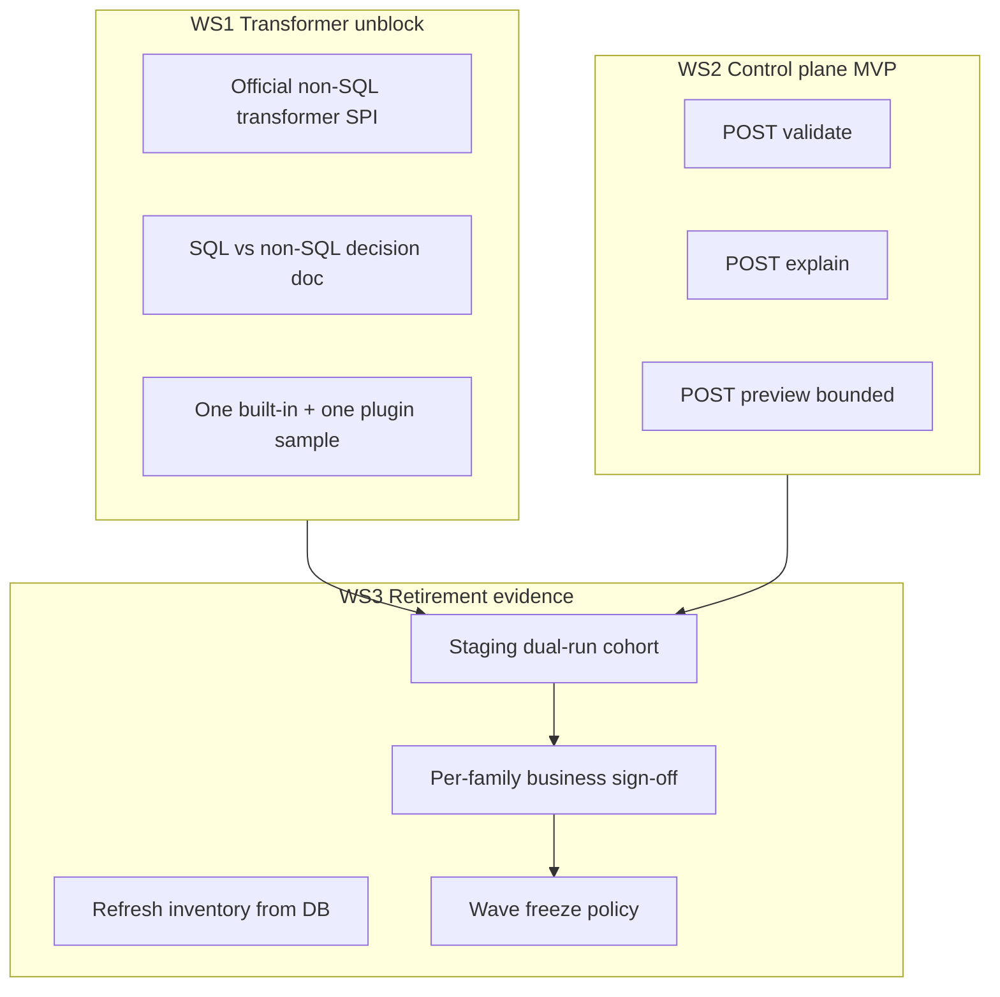

# V1 Retirement Alignment Design

## Metadata

| Field | Value |
|-------|-------|
| Status | Draft — pending review |
| Date | 2026-05-21 |
| Driver | Business constraint **A**: retire or freeze V1 templates on a fixed timeline |
| Depends on | `feature-4.0` (CHUNKED, migration workbench, Geo complete) |
| Supersedes | Ad-hoc feature ordering on `feature-4.0`; does not replace per-feature technical specs |

## Problem statement

`feature-4.0` advanced the **execution core** (V2 runner, CHUNKED JDBC, migration REST, Geo) faster than the **control plane** and **non-SQL transformer** paths documented as P0 in `docs/template-v2-product-roadmap.md`.

V1 cannot be retired safely while:

- script-heavy and orchestration-heavy templates lack a V2 transformer path (only SQL + UDF today);
- production templates lack staging dual-run evidence and per-family business sign-off (P3 gates open);
- operators lack template-level validate / explain / bounded preview outside migration-specific endpoints.

Retirement must be **evidence-driven**, not a calendar-only cutover.

## Goal

Reach **Gate P4 (Retirement gate)** from `docs/template-v2-migration-program.md`:

- every production template is either **on V2** (EXACT or ADAPTED), or **explicitly compatibility-only** on V1 with documented acceptance;
- no silent promotion of `COMPATIBILITY_ONLY` or `BLOCKED` rows;
- V1 execution is **frozen** (no new V1 templates, no edits except hotfix) then **disabled** by policy when cohort coverage thresholds are met.

## Non-goals (during retirement program)

- New vertical capabilities: streaming GeoJSON, Shapefile, Calcite-native `ST_*`, AI P1 governance depth
- Full governance plane: RBAC, secret vault, template publish/approval workflow, plugin marketplace
- Vaadin operator UI (helpful; not a retirement blocker if REST + scripts suffice)
- Byte-for-byte parity with V1 orchestration (`PAUSE`, `SHARED`, `LOG`, JavaScript stages)

## Retirement strategies considered

| Option | Description | Fit for constraint A |
|--------|-------------|----------------------|
| **Big-bang** | Single cutover date; all templates must be V2 or exempt | High risk; blocks on last script-heavy stragglers |
| **Wave freeze** (recommended) | Freeze V1 **by scenario family** as P3 sign-off completes | Matches inventory waves; reduces blast radius |
| **Authoring freeze only** | Stop new V1; keep running old V1 indefinitely | Fails true retirement; technical debt remains |

**Recommendation:** **Wave freeze** — align with `synthetic` → `multi_source` / conversion → `orchestration_legacy` compatibility bucket.

## Current state vs parity gates

| Gate | Requirement | Status on `feature-4.0` | Gap |
|------|-------------|---------------------------|-----|
| **P1 Technical** | V2 runnable for main families; validation acceptable | Strong for SQL/JDBC/iterator/file sinks; CHUNKED delivered | **Official non-SQL transformer missing**; V1 `SCRIPT` / JS stages unmapped |
| **P2 Operational** | explain, preview, run report, governance fit | Migration analyze/draft/compare/promote; query-source preview; summary/backlog APIs | **Template-level control plane MVP missing**; no unified run report |
| **P3 Business** | Family sign-off; dual-run evidence | Regression samples + inventory; sign-off API exists | **Staging production cohort not done**; `synthetic` / `multi_source` P3 unchecked |
| **P4 Retirement** | Coverage + compatibility-only list | Documented in `compatibility-only-templates.md` | **Production promote + freeze policy not executed** |

Geo (Phases 1–2D) is **out of retirement critical path** unless production templates depend on it; treat as complete, no further geo work before P4.

## Architecture: three workstreams

Workstreams run in parallel but merge at **staging acceptance** before each wave freeze.



### WS1 — Transformer unblock (P1 blocker)

**Purpose:** Close the largest **technical** blocker for script-heavy V1 templates listed in `docs/migration/compatibility-only-templates.md` and `recommendedPath: non_sql` / `custom` classifications.

**Scope (minimal):**

1. Define **`ScriptTransformVO`** (or `ExpressionTransformVO`) as the first official non-SQL built-in subtype — row-local deterministic logic only (no `PAUSE` / shared state).
2. Register factory on the same `TransformVO` registry + PF4J plugin path as SQL.
3. Output schema: explicit column declarations or infer-from-sample (bounded preview).
4. Document decision tree in `docs/template-v2-transformer-strategy.md`: when SQL+UDF vs non-SQL vs compatibility-only.

**Explicit exclusions:** orchestration stages (`PAUSE`, `SHARED`, `LOG`), JavaScript engine parity, arbitrary DAG transforms.

**Acceptance:** At least one repository template family (e.g. `regression-v1-iterator-simple` SCRIPT fields) migrates to V2 with non-SQL transform; migration analyzer recommends `non_sql` with a runnable draft.

### WS2 — Control plane MVP (P2 blocker)

**Purpose:** Satisfy migration program Step 3 (validate → explain → preview) for **any** V2 template, not only query-source migration endpoints.

**Scope (minimal REST on `TemplateController` or `TaskController`):**

| Action | Behavior |
|--------|----------|
| **Validate** | Structural + `TemplateV2Validator` + execution-shape / CHUNKED preflight |
| **Explain** | Source schemas, transform chain, sink plan, effective execution policy (extend `MigrationPlanExplainService` pattern) |
| **Preview** | Bounded row sample (default N≤100), same registry snapshot as run |

**Reuse:** `TemplateV2Runner` in-memory path for preview; do not build STREAMING mode.

**Acceptance:** Staging operator can preflight a promoted template without calling migration-specific URLs.

### WS3 — Retirement evidence (P3 / P4)

**Purpose:** Convert migration **tooling** into **business proof**.

**Cohort definition (staging):**

| Wave | Scenario family | Minimum templates | Dual-run expectation |
|------|-----------------|-------------------|-------------------|
| W1 | `synthetic` | 3 production + 3 regression | EXACT or ADAPTED; sign-off `synthetic` |
| W2 | `multi_source` / JDBC export | 2 lookup + 1 CHUNKED export | Compare report + CHUNKED ops checklist |
| W3 | `orchestration_legacy` | inventory only | Mark COMPATIBILITY_ONLY; **no promote** |

**Procedure (per template):**

1. `POST /migration/inventory/refresh`
2. `GET /migration/analyze/{id}`
3. `POST /migration/draft/{id}` → `POST /migration/compare/{id}` (or batch for catalog sweep)
4. Human review report under `docs/migration/reports/`
5. `POST /migration/inventory/{id}/signoff` when business accepts approximation
6. `POST /migration/promote/{id}` only if class ∈ {EXACT, ADAPTED} and not `compatibility_only`

**Automation already available:** `scripts/migration-staging.ps1`, `docs/migration/staging-runbook.md`, batch compare.

**Freeze policy (per wave):**

- After W1 sign-off: **no new** V1 templates in `synthetic` family; existing V1 synthetic may run until promoted or exempted.
- After W2 sign-off: same for JDBC / multi-source families.
- After W3 documentation: **global V1 freeze** — only compatibility-only templates may execute on V1; all others must be V2 or decommissioned.

**Hard retirement (P4):** Disable V1 branch in `TaskController` / service config flag `pci.data.generator.v1-execution.enabled=false` when:

- inventory summary shows ≥90% of **database-backed** templates are `v2DraftPresent` or `COMPATIBILITY_ONLY`;
- all scenario families in W1–W2 have `familySignoffComplete` via sign-off status API;
- zero `BLOCKED` templates without owner exception recorded in inventory `notes`.

## Data flow (operator view)

```
DB templates → inventory refresh → analyze/classify
       → draft → compare → report → sign-off → promote (V2 yaml on TemplatePO)
       → validate/explain/preview (control plane MVP)
       → task runById (V2 only after freeze)
```

## Error handling and safety

- **Promote guard:** Reject promote when `migrationClass` is `COMPATIBILITY_ONLY` or `BLOCKED` (service validation; may already exist — enforce in tests).
- **Compare guard:** Batch compare skips `COMPATIBILITY_ONLY` by default (implemented).
- **Freeze guard:** Optional read-only flag on V1 `TemplatePO` updates after wave freeze (config or validation on `updateById`).
- **Rollback:** Promote retains V1 yaml per existing promote semantics; operators can revert via DB backup / template version field when governance plane exists.

## Testing strategy

| Layer | Tests |
|-------|-------|
| WS1 | Unit tests for non-SQL transform; runner test with SCRIPT-migrated fixture |
| WS2 | Controller integration tests for validate/explain/preview (phase7-test profile) |
| WS3 | Extend staging script outputs; document evidence paths in `retirement-readiness.md` |

No requirement for full reactor green on every commit beyond existing CI; staging evidence is **manual + scripted** with archived reports in repo.

## Success metrics

| Metric | Target before global V1 disable |
|--------|-----------------------------------|
| DB templates with V2 promote | ≥90% of non–compatibility-only |
| EXACT + ADAPTED compare reports | ≥1 per W1/W2 family in `docs/migration/reports/` |
| P3 family sign-off | `synthetic`, `multi_source` = complete |
| COMPATIBILITY_ONLY | 100% documented in inventory; zero promoted |
| Control plane | validate + explain + preview callable for promoted templates |
| Non-SQL | ≥1 production-equivalent path proven in staging |

## Delivery phases

| Phase | Deliverable | Unblocks |
|-------|-------------|----------|
| **R0** (now) | Merge `feature-4.0`; run staging runbook on 1 JDBC + 1 synthetic template | P3 evidence started |
| **R1** | WS2 control plane MVP + REST tests | P2 partial close |
| **R2** | WS1 non-SQL transformer + analyzer hints | P1 script migration |
| **R3** | W1 + W2 cohort complete; update `retirement-readiness.md` checkboxes | P3 |
| **R4** | Config flag V1 disable; announcement + compatibility-only runbook | P4 |

Phases are **sequential for gates** but R1 and R2 may overlap in development.

## Roadmap document updates (after R3)

Update `docs/template-v2-product-roadmap.md` scenario matrix:

- Mark CHUNKED JDBC and migration workbench under Scenario C / F as **delivered on feature-4.0**.
- Add footnote: Geo delivered as domain extension, not a retirement prerequisite.
- Elevate control plane MVP and non-SQL transformer from P0 backlog to **in progress / done** when R1/R2 complete.

## Open decisions (resolve in review)

1. **V1 disable mechanism:** runtime flag vs remove `TaskController` V1 branch — recommend **flag** first.
2. **SCRIPT semantics:** SpEL subset vs sandboxed expression language — recommend **SpEL row expressions** aligned with existing faker/geo SpEL investment.
3. **Calendar:** product owner sets wave freeze dates after R0 staging results (not fixed in this spec).

## Revision history

| Date | Change |
|------|--------|
| 2026-05-21 | Initial design from product/roadmap gap analysis; constraint A (V1 retirement) |
