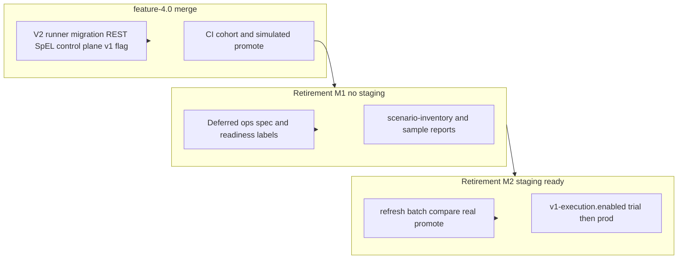

# V1 Retirement Deferred Operations Design

## Metadata

| Field | Value |
|-------|-------|
| Status | Approved (2026-05-21) |
| Date | 2026-05-21 |
| Driver | Constraint **A** (V1 retire/freeze); **no staging** in short term; **merge decoupled** from retirement |
| Parent | `docs/superpowers/specs/2026-05-21-v1-retirement-alignment-design.md` |
| Branch | `feature-4.0` merges as capability delivery; retirement continues as post-merge ops program |

## Problem statement

Engineering on `feature-4.0` closed most **P1/P2** retirement workstreams (migration REST, control plane, SpEL transform, V1 execution flag, CI regression). **Staging is not available** (datasources/catalog not aligned). **Merge must not wait** for production `db-{id}` promote or P4 cutover.

Without an explicit **deferred-ops** model, teams either block the merge on fictitious staging evidence or confuse CI simulation with production retirement completion.

## Goal

1. **Merge `feature-4.0` now** with clear scope: capabilities delivered, retirement milestones deferred.
2. Keep Constraint A on track via **documented M1 (pre-staging)** and **M2 (staging-ready)** gates.
3. Use **CI cohort + simulated promote** as auditable pre-staging evidence—not a claim of production promote.

## Non-goals

- Real staging `batch compare` / `db-{id}` promote in the merge window
- Production or staging `pci.data.generator.v1-execution.enabled=false`
- Vaadin operator UI, new Geo phases, remote staging IT in default CI
- Expanding the 61-template CI suite unless a regression gap is found

## Constraints (confirmed)

| Constraint | Choice |
|------------|--------|
| Staging availability | **C** — None short term; CI simulation + regression cohort only |
| Merge vs retirement | **C** — Decoupled; `feature-4.0` = capability branch; retirement = separate ops milestone |

## Success criteria

### Merge gate (immediate)

- Reactor or agreed module subset: `.\mvnw-jdk25.ps1 test` green
- Retirement CI slice green, including at minimum:
  - `BuiltinClasspathTemplateRegressionTests`
  - `BuiltinClasspathTemplateMigrationWorkflowTests`
  - `MigrationWaveCohortSignoffTests`
  - `StagingSimulatedPromoteWorkflowTests`
- MR describes **delivered capabilities** vs **post-merge retirement items**

### Retirement M1 (pre-staging; documentation + CI)

- P1/P2 technical items remain checked in `docs/migration/retirement-readiness.md`
- P3 cohort sign-off exercised in CI (`MigrationWaveCohortSignoffTests`); **do not** check “production templates promoted”
- P4 remains **unchecked**; `v1-execution.enabled` stays default `true` in all deployed configs
- `docs/migration/wave-freeze-schedule.md` states calendar is **pending staging R0** (no fake dates)
- This spec and readiness doc cross-link **evidence substitutes** (table below)

### Retirement M2 (staging-ready; operations)

- `POST /template/migration/inventory/refresh` on staging DB
- `POST /template/migration/compare/batch` (cap per policy) with reports under `docs/migration/reports/`
- Promote `db-{id}` rows with classification ∈ {EXACT, ADAPTED, APPROXIMATE} after human review
- Product owner sets W1/W2 dates in `wave-freeze-schedule.md`
- Staging trial: `v1-execution.enabled=false` + smoke (V2 preview OK, V1 run rejected)
- Prod cutover only after M2 staging sign-off

## Evidence substitutes (M1)

When staging is unavailable, the following **stand in** for staging dual-run reports. They do **not** satisfy P3 “production templates promoted” or P4.

| Intended staging evidence | M1 substitute | Location |
|-------------------------|---------------|----------|
| 1× synthetic dual-run | Regression `v1-iterator-simple` + `StagingSimulatedPromoteWorkflowTests` synthetic path | `migration/regression/`, CI |
| 1× JDBC dual-run | `StagingSimulatedPromoteWorkflowTests` JDBC path (builtin `parking/11` H2-adapted, SQL+SpEL compare/promote) | CI |
| W1/W2 family sign-off | `MigrationWaveCohortSignoffTests` + `scenario-inventory.yaml` cohort | CI + inventory file |
| Full catalog analyze | `BuiltinClasspathTemplateRegressionTests` (~61 yaml) | CI |
| Promote workflow | `StagingSimulatedPromoteWorkflowTests` (refresh → compare → signoff → promote) | CI |

## Architecture: merge vs retirement milestones

**Runtime data flow (unchanged from parent spec):** operators still use migration REST; M1 only changes **where evidence is recorded**, not API shapes.

## Priority work (next 2–3 weeks)

| Priority | Work | Owner type |
|----------|------|------------|
| **P0** | Publish this spec; update `retirement-readiness.md` and `wave-freeze-schedule.md` with M1/M2 labels | Engineering + doc |
| **P0** | `feature-4.0` merge package: full test, MR narrative, sync with target branch | Engineering |
| **P1** | Staging readiness checklist (template count, datasource IDs, env owner)—no execution | Ops |
| **P1** | Optional: enforce `businessSignoffApproved` before promote (service guard + test) | Engineering |
| **defer** | Staging sweep, Prod V1 disable, Vaadin, Geo 2E+, default remote staging tests | Post-M2 |

**Explicitly not P0:** real `db-{id}` promote, Prod flag flip, additional large CI harnesses.

## Component boundaries

| Unit | Responsibility | Consumers |
|------|----------------|-----------|
| **Capability code** (`feature-4.0`) | Migration, control plane, SpEL, V1 flag | REST, TaskController, tests |
| **CI simulation tests** | Prove workflow without staging | CI merge gate |
| **scenario-inventory.yaml** | Cohort definitions and sample report paths | Sign-off tests, operators |
| **Deferred ops docs** | Truth for what is/is not done pre-staging | Product, ops, MR reviewers |
| **staging-runbook.ps1** | M2 execution only | Ops when env ready |

## Error handling and policy

| Situation | M1 behavior |
|-----------|-------------|
| Promote COMPATIBILITY_ONLY / BLOCKED | Rejected (existing `MigrationPromoteService` guard + CI negative test) |
| Promote without compare report | Allowed today; **M1 optional hardening:** require inventory row with report path |
| Sign-off without compare | Allowed today; **M1 optional hardening:** require `businessSignoffApproved` before promote |
| Claim P3 production promote | **Forbidden** in MR/readiness until M2 |
| Claim P4 cutover | **Forbidden** until M2 staging trial |

## Testing strategy

- **Merge CI:** existing simulated workflow tests; no new default-ci remote staging tests.
- **M2 add-on (later):** manual/scripted `migration-staging.ps1`; optional `@Tag("staging")` IT if team wants—out of merge scope.
- **Regression bar:** do not require 100% of 61 builtins to produce valid V2 draft; current tests already scope migratable subsets.

## Documentation updates (implementation of this spec)

| File | Change |
|------|--------|
| `docs/migration/retirement-readiness.md` | Add M1/M2 sections; relabel P3 production promote; link evidence substitutes |
| `docs/migration/wave-freeze-schedule.md` | State M1 = CI evidence; M2 = calendar after staging R0 |
| `docs/migration/staging-runbook.md` | Front-matter: **M2 only**; not required for merge |
| MR / `MR-feature-4.0.md` | Capability list + deferred retirement checklist |

## Relationship to parent retirement design

| Parent item | Status on `feature-4.0` | Deferred to M2 |
|-------------|-------------------------|----------------|
| WS1 SpEL transform | Delivered | — |
| WS2 control plane | Delivered | — |
| WS3 staging cohort | CI pre-staging only | Real DB promote |
| R4 V1 flag | Delivered (default on) | Set `false` in env |
| Wave freeze dates | Placeholder | Product calendar after staging |

## Resolved decisions

| Topic | Decision |
|-------|----------|
| Merge blocker | **No** — capability + CI green sufficient |
| P3 production promote checkbox | **Unchecked** until M2 |
| P4 cutover | **M2 only** |
| CI as evidence | **Yes** for M1; labeled substitute, not production claim |
| Next engineering code | **Optional** promote/sign-off guard only; else docs-only |

## Revision history

| Date | Change |
|------|--------|
| 2026-05-21 | Initial spec: approved §1–§4 from brainstorming (staging C, merge decoupled C) |
