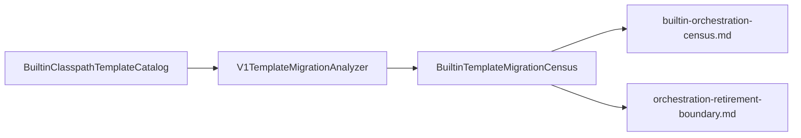

# W3 Orchestration Blocking Assessment Design

## Metadata

| Field | Value |
|-------|-------|
| Status | Implemented (2026-05-22) |
| Date | 2026-05-22 |
| Driver | Path **B** — staging unavailable; need honest V1 retirement boundary before M2 |
| Strategy | **S1** — permanent V1 exemption for `orchestration_legacy` (no W3 freeze date) |
| Approach | **B2** — automated builtin census + committed report + ADR docs |
| Depends on | `V1TemplateMigrationAnalyzer`, `BuiltinClasspathTemplateCatalog`, M1 SpEL draft/compare (complete) |
| Parent | `docs/superpowers/specs/2026-05-21-v1-retirement-alignment-design.md` (WS3) |
| Plan | `docs/superpowers/plans/2026-05-22-w3-orchestration-blocking-assessment.md` |

## Problem statement

M1 delivered migration REST, SCRIPT→SpEL draft/compare, and CI substitutes for staging. **SpEL 2b does not retire V1 holistically:**

- `V1TemplateMigrationAnalyzer` marks templates with **PAUSE**, **LOG**, **SHARED**, or **JAVASCRIPT** as `COMPATIBILITY_ONLY` / `recommendedPath: compatibility_only`.
- Scenario family **`orchestration_legacy`** is excluded from W1/W2 wave-freeze promote cohorts.
- Product and engineering lack a **quantified, committed** view of how many built-in templates fall into each bucket.

Without this assessment, stakeholders may assume `feature-4.0` enables universal promote, delaying honest calendar communication until staging fails on orchestration templates.

## Goal

Produce **auditable evidence** (no staging required) that answers:

1. How many **builtin** templates (~61) are `COMPATIBILITY_ONLY` vs migratable paths (`spel`, `sql`, …)?
2. Which **blocker signals** (PAUSE / LOG / SHARED / JS) drive exemption?
3. What is the **product policy** for W3 (recommend **S1**: permanent exemption, document-only)?
4. What remains **M2-only** (production `db-{id}` inventory census)?

## Non-goals

- Implementing V2 orchestration (PAUSE/LOG/SHARED/JS runtime)
- Staging `refresh` / batch compare / production promote
- Changing analyzer classification rules (unless census reveals a clear bug — separate fix)
- Vaadin migration UI
- Production DB catalog scan in this epic (document as M2 follow-up)

## Constraints

| Constraint | Implication |
|------------|-------------|
| Staging unavailable | Builtin classpath scan only for numeric census |
| S1 policy | W3 row in `wave-freeze-schedule.md` stays “no freeze” |
| YAGNI | Test-scoped census writer; no new REST API |
| Merge safety | Docs + test only; no promote/compare behavior change |

## Architecture

- **Input:** every `classpath:template/**/*.yaml` fixture (skips `!` drafts).
- **Processing:** `analyze(TemplateVO)` per fixture; aggregate counts by `suggestedClass`, `recommendedPath`, `scenarioFamily`, blocker keywords.
- **Output:** committed markdown report under `docs/migration/reports/` plus one-page operator/product boundary doc.

## Deliverables

| Artifact | Path |
|----------|------|
| Census engine (test scope) | `data-generator-service/src/test/java/.../BuiltinTemplateMigrationCensus.java` |
| Census test + invariants | `.../BuiltinTemplateMigrationCensusTest.java` |
| Committed report | `docs/migration/reports/builtin-orchestration-census.md` |
| Boundary one-pager | `docs/migration/orchestration-retirement-boundary.md` |
| Doc updates | `wave-freeze-schedule.md`, `compatibility-only-templates.md`, `retirement-readiness.md`, `deferred-ops-design.md` |

## Report requirements

### Summary section (required)

- `total` template count (expect ≥ 50)
- `compatibility_only` count and percentage
- Counts by `scenarioFamily`: `synthetic`, `multi_source`, `orchestration_legacy`
- Counts by `recommendedPath`: `spel`, `sql`, `sql_udf`, `compatibility_only`, `custom`, …
- Blocker signal counts (non-exclusive): PAUSE, LOG, SHARED, JAVASCRIPT

### Detail table (required)

Columns: `relativePath`, `scenarioFamily`, `suggestedClass`, `recommendedPath`, `blockers` (semicolon-separated).

### Known anchors (test assertions)

- `migration/regression/v1-with-pause.yaml` → `COMPATIBILITY_ONLY`, family `orchestration_legacy`
- `tocc/parking/11_parking_online_space_record.yaml` → not `COMPATIBILITY_ONLY`, `recommendedPath` includes `spel`

## Product policy (S1 — approved)

| Bucket | Policy |
|--------|--------|
| **W1 / W2 migratable** | `synthetic` / `multi_source` without orchestration blockers; SpEL draft + compare (M1); promote after M2 evidence |
| **W3 orchestration_legacy** | Remain on V1; **no** wave-freeze date; listed in census + compatibility doc |
| **P4 cutover** | Only after M2 promote + family sign-off; W3 exempt templates stay on V1 via explicit list |

## M2 follow-up (explicitly deferred)

When staging is ready:

1. `POST /template/migration/inventory/refresh`
2. Export or summarize production `migrationClass` distribution
3. Append **Part B: production catalog** to census doc or separate `production-migration-census.md`

## Success criteria

- [ ] `BuiltinTemplateMigrationCensusTest` green with summary invariants
- [ ] `builtin-orchestration-census.md` committed and referenced from readiness doc
- [ ] `orchestration-retirement-boundary.md` published for product/engineering
- [ ] W3 docs aligned with S1 (no freeze date for orchestration)
- [ ] `.\mvnw-jdk25.ps1 -pl data-generator-service -am test` green for census slice

## References

- `docs/migration/compatibility-only-templates.md`
- `docs/migration/wave-freeze-schedule.md`
- `docs/migration/retirement-readiness.md`
- `docs/superpowers/specs/2026-05-21-v1-retirement-deferred-ops-design.md`
