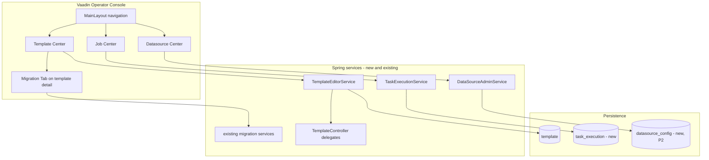

# Operator Console Design (Vaadin + Template V2 Forms)

## Metadata

| Field | Value |
|-------|-------|
| Status | **Approved (2026-05-23)** |
| Date | 2026-05-23 |
| Driver | Product target: browser-based **template CRUD**, **task status/history**, **datasource admin**, plus **migration** as a sub-module |
| Editor model | **C** — V2 structured forms as primary; YAML as advanced mode |
| Parent | `docs/superpowers/specs/2026-05-21-v1-retirement-deferred-ops-design.md`, `docs/migration/orchestration-retirement-boundary.md` |
| Branch | Implement on `feature-4.0` or follow-on `feature-operator-console` |

## Problem statement

Today operators rely on REST/curl and file upload:

- Templates: `updateById`, `uploadTemplate`; list/run via `TaskController` only.
- Tasks: fire-and-forget `runById` returns `instanceId` with **no status API** and **no persisted history**.
- Datasources: runtime `DynamicRoutingDataSource` CRUD; persistence across restart is unclear.
- Migration: rich `/template/migration/*` APIs with **no UI**.
- **No Vaadin** in `data-generator-service` despite BOM in root POM.

A prior plan scoped only a “migration workbench.” The agreed **end state** is a full **operator console**; migration is one tab, not the product.

## Goals

1. **Template center (V2-first):** create/edit Template V2 via **structured forms**; **YAML advanced** for power users; round-trip without corrupting types.
2. **Task center:** trigger runs, show **live status**, browse **historical executions** with errors/metrics.
3. **Datasource center:** list/add/remove JDBC sources (and driver upload) from the UI.
4. **Migration tab:** analyze / draft / compare / sign-off / promote on `db-{id}` rows; W3 templates read-only per policy **S1**.
5. Keep **retirement honesty:** console improves ops; **M2 staging promote** and **P4** cutover remain gated per existing docs.

## Non-goals (this program)

- Visual V1 stage editor (PAUSE/LOG/SCRIPT pipelines) — YAML-only on V1 until promoted.
- **W3 V2 orchestration parity** (PAUSE/LOG as V2 transforms) — separate spike; default **S1 exempt**.
- Replacing Calcite/SQL authoring with a full query builder IDE.
- Multi-tenant RBAC (optional hardening later; see Security).
- Remote staging IT in default CI.

## Constraints

| Constraint | Choice |
|------------|--------|
| UI stack | Vaadin **24.4** (`vaadin-spring-boot-starter` in `data-generator-service`) |
| Template authoring | **C** — forms primary; YAML advanced secondary |
| V1 templates | Open in **read-only** + link to migration; edit in forms only after V2 promote |
| W3 policy | **S1** — `COMPATIBILITY_ONLY`; no promote from UI |
| Retirement merge | Console delivery **decoupled** from M2/P4 (same deferred-ops model) |

## Current backend inventory (reuse)

| Domain | Existing endpoints | Notes |
|--------|-------------------|--------|
| Template persist | `POST /template/updateById`, `uploadTemplate`, `reloadAllFromFile` | No create-by-body; no delete |
| V2 control plane | `POST /template/v2/validate`, `GET explain`, `POST preview` | Used by editor save/preview |
| Task run | `GET /task/runById`, `runByName`, `list`, `findById` | Async; no status/history |
| Datasource | `GET /datasource/database/list`, `POST add/remove`, driver upload | Runtime registry |
| Migration | `/template/migration/*` | Complete for M1 evidence |

## Target architecture



**Module placement:** `org.gensokyo.data.ui.*` views + `org.gensokyo.data.service.operator.*` (or `template.editor`, `task.execution`) in `data-generator-service`. No separate UI module in P0–P3 unless classpath size forces split.

## Template Center — Option C (forms + YAML)

### Modes

| Mode | When | Behavior |
|------|------|----------|
| **Form** (default) | Template is V2 (or new) | Multi-step binder on `TemplateV2DraftVO` |
| **YAML advanced** | User toggles | Monaco or large `TextArea`; parse ↔ bind via `YamlParser` |
| **V1 legacy** | `TemplateDefinitionKind.V1` | Banner: read-only form; buttons: Analyze migration, Open YAML (read-only), Promote path via Migration tab |

### Form wizard steps (V2)

Bind to `TemplateV2DraftVO` (not normalized `TemplateV2VO` until save):

1. **General** — `name`, `generator` (type, batch, executor caps).
2. **Sources** — repeatable cards keyed by source name; `type` discriminator:
   - **P1 (MVP):** `query` (`QuerySourceVO`), `iterator` (`IteratorSourceVO`).
   - **P1.5+:** `json`, `csv`, `excel`, `geojson`, `postgis`, `ai` (per rollout).
3. **Transform** — single primary `transform` + optional `transformers` list:
   - `sql` — SQL text + dialect hints.
   - `spel` — expression list (reuse field names from `SpelTransformVO`).
4. **Sinks** — `sinks` list / primary `sink`; **P1 types:** `CONSOLE`, `JDBC`, `KAFKA`, `ELASTICSEARCH` (see `ConsoleWriterVO`, `JdbcWriterVO`, `KafkaWriterVO`, `ElasticsearchWriterVO`).
5. **Execution** — `executionPolicy`, `sinkExecutionPolicy` (mode CHUNKED/BOUNDED, chunk sizes).
6. **Review** — summary + actions: Validate, Preview (bounded rows), Save, Run.

### Form ↔ YAML sync rules

- **Form → YAML:** `yamlParser.dump(draft)` on every step “Apply” and before save.
- **YAML → Form:** parse as `TemplateV2DraftVO`; on failure show line-level error; on success replace binder bean.
- **Save pipeline:** `TemplateV2Normalizer.normalize` → `TemplateV2Validator.validate` → persist `contentYaml` + `TemplateJsonCodec.write` (same as promote/migrate paths).
- **Conflict policy:** if user edits YAML while form is dirty, prompt: *Discard form / Discard YAML / Merge (YAML wins)* — MVP: **YAML wins** with confirm dialog.

### New REST (template editor)

Thin layer used by Vaadin (controllers may delegate to services):

| Method | Path | Purpose |
|--------|------|---------|
| POST | `/template/v2/create` | Empty draft with defaults (console, iterator smoke) |
| GET | `/template/v2/editor/{id}` | `EditorPayload`: draft + `kind` + migration hints |
| PUT | `/template/v2/editor/{id}` | Save from draft body (validates first) |
| POST | `/template/{id}/archive` | Sets `archived=true`; hidden from default list; reject if execution RUNNING |
| POST | `/template/{id}/restore` | Clears `archived` (admin) |

Existing `updateById` remains for backward compatibility; console uses V2 editor API only.

### UI components (Vaadin)

| View | Route (example) | Notes |
|------|-----------------|-------|
| `TemplateListView` | `templates` | Grid: id, name, kind, updated, actions |
| `TemplateEditorView` | `templates/{id}` | Stepper + toggle “Advanced YAML” |
| `TemplateCreateView` | `templates/new` | Wizard from empty draft |

**Validate / Preview:** call existing `/template/v2/validate` and `/template/v2/preview/{id}` (after temp save or in-memory draft endpoint if added).

## Job Center — task status and history

### Problem

`TaskController` submits to `ThreadPoolTaskExecutor` and logs completion; **no query surface**.

### Data model (new)

```text
task_execution
  id                 BIGINT PK (snowflake)
  template_id        BIGINT NOT NULL
  template_name      VARCHAR
  instance_id        BIGINT NOT NULL
  definition_kind    VARCHAR(8)   -- V1 | V2
  status             VARCHAR(16)  -- QUEUED | RUNNING | SUCCESS | FAILED | CANCELLED
  queued_at          TIMESTAMP
  started_at         TIMESTAMP
  finished_at        TIMESTAMP
  row_count          BIGINT NULL
  error_message      VARCHAR(4000) NULL
  metrics_json       CLOB NULL      -- V2 RunMetrics serialized
```

Indexes: `(template_id, finished_at DESC)`, `(instance_id)`.

### Service hooks

| Execution path | On submit | On complete |
|----------------|-----------|-------------|
| V1 `DefaultDataPipelineTask` | insert QUEUED → RUNNING | SUCCESS/FAILED + duration |
| V2 `templateV2Runner.run` | same | persist `metrics_json`, row_count from `TemplateV2RunResult` |

### REST (new `TaskExecutionController` or extend `TaskController`)

| Method | Path |
|--------|------|
| POST | `/task/run/{templateId}` (prefer POST over GET for UI) |
| GET | `/task/executions` — query: `templateId`, `status`, `from`, `to`, `page`, `size` |
| GET | `/task/executions/{instanceId}` |
| POST | `/task/executions/{instanceId}/cancel` — best-effort (MVP: mark CANCELLED if not started) |

### Vaadin

| View | Route |
|------|-------|
| `JobListView` | `jobs` | Grid + filters |
| `JobDetailView` | `jobs/{instanceId}` | Status timeline, error, metrics JSON pretty-print |

**Template editor “Run”** navigates to job detail with polling (2s) until terminal state.

## Datasource Center

### MVP (P2)

- Grid bound to `GET /datasource/database/list`.
- Form: name, driver class, URL, user, password (masked), pool opts.
- Actions: Add (`POST addDatasource`), Remove, Upload driver JAR.
- **New:** `POST /datasource/database/test` — validates connection without persisting bad config.

### Persistence (**approved: D1**)

**`datasource_config` table** is the source of truth; on application startup a `DataSourceBootstrap` loads all non-deleted rows into `DynamicRoutingDataSource`. UI add/remove updates DB **and** runtime registry. Driver JAR paths stored on row (reuse `uploaded-drivers/` layout). Optional one-time import from existing Spring dynamic-datasource yaml for greenfield installs.

## Migration tab (subset of Template Editor)

Embedded in `TemplateEditorView` when `db-{id}` inventory row exists or analyze returns migratable:

| Action | API | UI rule |
|--------|-----|---------|
| Analyze | `GET /migration/analyze/{id}` | Show family, blockers, path |
| Draft | `POST /migration/draft/{id}` | Open diff: V1 YAML read-only vs V2 draft preview |
| Compare | `POST /migration/compare/{id}` | Link `reportPath`; classification badge |
| Sign-off | `POST /migration/inventory/{id}/signoff` | If inventory id known |
| Promote | `POST /migration/promote/{id}` | Disabled when `COMPATIBILITY_ONLY` |

**W3 (demo/18, demo/27, PAUSE/LOG):** show census link; promote button hidden.

Global views (lower priority): `MigrationDashboardView` at `migration` — summary + backlog grid from `/migration/summary`, `/migration/backlog`.

## W3 orchestration (deferred — P5 or never)

Under policy **S1**, do **not** block console phases on PAUSE/LOG V2 design.

If product later requests parity:

- Spike doc: `docs/superpowers/specs/2026-05-23-w3-v2-orchestration-spike-design.md`
- UI shows “Orchestration legacy” badge only; no PAUSE duration editor in forms.

## Security (phased)

| Phase | Approach |
|-------|----------|
| P0–P3 | Assume **trusted intranet**; optional HTTP basic behind reverse proxy |
| P4+ | Spring Security + role `OPERATOR`, `ADMIN` for promote/datasource delete |

## Implementation phases and acceptance

### P0 — Shell (3–5 days)

- Add Vaadin starter to `data-generator-service`.
- `MainLayout`: Templates | Datasources | Jobs | Migration dashboard.
- Health banner: V1 execution flag from `DataGeneratorProperties`.

**Done when:** app starts, routes render, no business logic required.

### P1 — Template V2 forms + YAML (3–4 weeks)

- `TemplateEditorService` + REST create/save/editor payload.
- Vaadin wizard (General → Sources [query+iterator] → Transform [sql+spel] → Sinks [console+jdbc+kafka+elasticsearch] → Execution → Review).
- YAML advanced toggle with sync rules.
- V1 read-only path + link to migration tab.
- Integrate validate/preview on Review step.

**Done when:** operator can create a new V2 iterator+console template, save, reload, validate green, preview rows, without curl.

### P2 — Datasources (1–2 weeks)

- `datasource_config` table + startup loader (**D1**).
- Vaadin CRUD + connection test.

**Done when:** add H2/MySQL source in UI, reference in `QuerySourceVO.dataSourceId`, restart survives.

### P3 — Jobs (2–3 weeks)

- `task_execution` table + hooks in V1/V2 runners.
- REST list/detail/run + Vaadin Job center.
- Template editor Run → job detail polling.

**Done when:** run template, see RUNNING→SUCCESS in UI, history lists last 50 runs.

### P4 — Migration tab + dashboard (1 week)

- Wire existing migration APIs in template detail + optional dashboard.

**Done when:** parking-style template can compare and show report link from UI (staging DB optional).

### P5 — W3 spike (optional)

- ADR only unless S2 approved.

## Relationship to V1 retirement

| Milestone | Console role |
|-----------|----------------|
| **M1** (done) | REST/CI still sufficient for merge evidence |
| **M2** | Console accelerates inventory refresh, batch compare review, promote sign-off |
| **P4 cutover** | Job history + V2-only run support operator confidence before `v1-execution.enabled=false` |

Console is **not** a merge blocker per deferred-ops spec.

## Risks

| Risk | Mitigation |
|------|------------|
| Form coverage lags V2 model | Phased source types; YAML advanced always available |
| Vaadin beta | Pin version; smoke test on JDK 25 |
| Large YAML sync bugs | Single `TemplateEditorService` serialization path; tests |
| Task cancel on V1 pipeline | Document best-effort; true interrupt deferred |
| CHUNKED runs memory | History stores metrics only, not row payloads |

## Approved product decisions (2026-05-23)

| # | Decision |
|---|----------|
| 1 | **D1** — `datasource_config` JPA table + startup load into `DynamicRoutingDataSource` |
| 2 | Template removal → **`archived`** on `template` (`archived` boolean, `archived_at` timestamp); list APIs exclude by default |
| 3 | **P1 sink forms:** `CONSOLE`, `JDBC`, `KAFKA`, `ELASTICSEARCH` |

## References

- `docs/migration/workbench-usage.md`
- `docs/migration/orchestration-retirement-boundary.md`
- `docs/migration/M2-production-catalog-handoff.md`
- `docs/calcite-templatev2-model-design.md`
- `docs/template-v2-jdbc-chunked-execution-guide.md`
- `docs/superpowers/specs/2026-05-21-v1-retirement-deferred-ops-design.md`

## Spec self-review

- [x] Option **C** reflected as primary editor model with explicit YAML advanced rules.
- [x] End-state modules: templates, jobs, datasources, migration — not migration-only.
- [x] Backend gaps (execution table, editor REST) called out before Vaadin-only work.
- [x] W3 scoped to P5 / S1; no false promise of PAUSE form fields.
- [x] Retirement M1/M2/P4 relationship stated; no merge-blocker claim.
- [x] Product decisions locked (D1, archived, P1 sinks incl. kafka/es).

---

**Implementation plan:** `docs/superpowers/plans/2026-05-23-operator-console.md`
