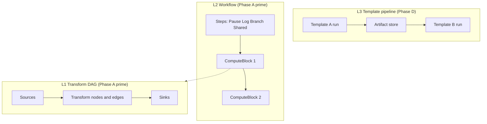

# Template V2-Only Full Capability Design

## Metadata

| Field | Value |
|-------|-------|
| Status | **Approved** (2026-05-29) |
| Date | 2026-05-29 |
| Driver | Product direction: V2 as sole template/runtime path with **full** generation, orchestration, and scale capabilities — **without** historical V1 template or code compatibility |
| Phasing | **D model:** Phase A → A′ → B → C (C1 then C2) → **D (far-term)** template-level DAG |
| Distributed | **C1** in-process partitioned parallelism first; **C2** multi-node Coordinator + Worker later |
| Supersedes | Retirement policy **S1** (permanent V1 exemption for PAUSE/LOG orchestration); `docs/migration/orchestration-retirement-boundary.md` product narrative for **new** V2 work |
| Related | `docs/template-v2-product-roadmap.md`, `docs/template-v2-transformer-strategy.md`, `docs/template-v2-execution-scalability-plan.md`, `docs/template-v2-control-plane-requirements.md`, `docs/calcite-implementation-status.md` |

## Problem statement

`feature-4.0` / `master` delivers a strong V2 **linear** execution path (SQL, SpEL, CHUNKED, multi-source/sink, control-plane validate/explain/preview, React console). Planning documents still treat orchestration (PAUSE, LOG, SHARED, branching), JavaScript scripts, rich selectors, transform DAGs, and cluster scheduling as **V1 compatibility-only** or **non-goals**.

The product now requires these capabilities on a **V2-native** foundation. Historical V1 YAML, stage classes, and byte-for-byte selector semantics are **out of scope**; capability parity at the **scenario** level is in scope.

Additionally, **template-level DAG** (template A output feeds template B input) is required as a **far-term** capability with **extension points reserved now**.

## Goal

Template V2 becomes the only authoring and runtime model, supporting:

1. **Compute** — sources, transform DAG, sinks, scale modes (in-memory, CHUNKED, STREAMING).
2. **Workflow** — PAUSE, LOG, SHARED state, conditional branches, multiple compute blocks per template.
3. **Scripting** — SpEL and **JavaScript** (GraalJS) transforms with sandbox boundaries.
4. **Selection** — materialization policies (equal, weight, once, order, limit) as **new** V2 semantics.
5. **Operations** — governance, RBAC, publish flow, rich run reports (Phase B).
6. **Scale-out** — C1 process-internal partitioning, then C2 distributed Coordinator/Worker (Phase C).
7. **Far-term pipelines** — inter-template DAG with artifact store (Phase D).

## Non-goals

| Item | Rationale |
|------|-----------|
| Loading unmodified historical V1 templates | No V1 YAML compatibility layer |
| Reusing V1 `PipelineTask` / stage implementations | Greenfield V2 types and runners |
| Dual-run, promote, `COMPATIBILITY_ONLY` migration UX as product path | Deprecate migration workbench for new work; optional import tool only |
| Byte-for-byte V1 selector random sequences | V2 `MaterializationPolicyVO` defines its own semantics |
| Implementing Phase D template DAG in Phases A–C | Far-term; reserve APIs only |
| Arbitrary cross-template mutable shared state without scope rules | SHARED is scoped (workflow or block), documented |
| Full distributed stream processor (Flink/Spark) | Bounded product cluster scheduler only |

## Capability layers

Avoid conflating three “DAG” concepts:

| Layer | Name | Scope | Phase |
|-------|------|-------|-------|
| **L1** | Transform DAG | Inside one **ComputeBlock** | A′ |
| **L2** | Workflow | Inside one **template**: steps + compute blocks | A′–B |
| **L3** | Template pipeline DAG | **Template A artifact → Template B source** | **D (far-term)** |
| **L4** | Cluster execution | Parallel/partitioned runs for L1–L3 | C1, C2 |

## Architecture (recommended: two-layer model)

### Template document shape (evolutionary)

**Near term (Phase A):** retain current `TemplateV2VO` (`sources`, linear `transformers`, `sinks`, policies) for backward compatibility with templates already on `master`.

**Phase A′:** introduce optional `workflow` and/or `computeBlocks[]`. Each `ComputeBlock` contains:

- `sources[]`
- `transforms`: either linear list **or** `nodes[]` + `edges[]` (L1 DAG)
- `sinks[]`
- optional block-local `sharedScope`

**Workflow steps** (L2), as typed step subtypes (not SQL transforms):

| Step type | Purpose |
|-----------|---------|
| `PauseStepVO` | `duration`, `until`, or conditional wait |
| `LogStepVO` | Structured log + run-report metrics |
| `BranchStepVO` | Condition → child step list or compute block id |
| `SharedScopeVO` | Named map lifecycle (open/read/write/close) |
| `InvokeComputeBlockStepVO` | Run one compute block |

**Transforms** (L1, inside compute block):

| Transform type | Purpose |
|----------------|---------|
| `SqlTransformVO` | Existing SQL path |
| `SpelTransformVO` | Existing row-local SpEL |
| `JsTransformVO` | GraalJS, sandboxed, timeout, no arbitrary IO |
| `CustomTransformVO` | Plugin-provided (SPI) |

**Selection:** `MaterializationPolicyVO` on sources (replaces “V1 selector parity” goal with explicit V2 rules).

### Runtime

| Component | Responsibility |
|-----------|----------------|
| `TemplateV2Validator` | Structural + semantic validation for workflow, DAG acyclicity, JS sandbox policy |
| `WorkflowRunner` | L2 step machine, pause/resume, branch routing |
| `ComputeBlockRunner` | Source materialization → L1 DAG execution → sink fan-out |
| `TemplateV2Runner` | Facade; dispatches linear legacy templates vs workflow templates |
| `RunReportCollector` | Per-source/transform/sink metrics, log step output, error samples |

### Phase D reservations (no implementation in A–C)

| Reservation | Purpose |
|-------------|---------|
| `PipelineSpecVO` (optional root document) | Nodes = `templateId@version`, edges = artifact dependency |
| `TemplateRunSourceVO` | Source reads prior run artifact by `pipelineRunId` + `upstreamNodeId` |
| Run metadata | `parentPipelineRunId`, `upstreamArtifactRefs[]` on execution records |
| Console | Hidden or stub “Pipelines” nav until Phase D |

**Artifact store (Phase D):** temporary JDBC table, object file, or Kafka topic with TTL; schema contract on edges.

## Phased delivery

### Phase A — Production batch (compute hardening)

**Success criteria:** Main scenario families runnable on V2-only templates with observability; no V1 runtime required for those scenarios.

| Workstream | Deliverables |
|------------|--------------|
| Scale | CHUNKED hardening; **STREAMING** v1; template `maxRows` / memory guards |
| Sinks | Retry/backoff; partial-success reporting under `CONTINUE_ON_ERROR`; sink preflight |
| Control plane | Staged preview (by transform index); run report (counts, timing, error samples) |
| Product | Scenario template library (new YAML, not migrated V1); console paths documented |
| Cleanup | Remove Vaadin artifacts; migration UI de-emphasized or admin-only |

**Does not include:** workflow steps, transform DAG, JS transform, template pipeline.

### Phase A′ — Workflow + L1 DAG + scripts + selectors

**Success criteria:** New **authored** templates demonstrate PAUSE, LOG, SHARED, branch, JS, transform DAG, and materialization policies; CI uses these templates only.

| Workstream | Deliverables |
|------------|--------------|
| L1 DAG | `TransformNodeVO` + edges; topological execution; cycle detection in validator |
| L2 workflow | Step types listed above; `WorkflowRunner` with pause/resume state |
| JS | `JsTransformVO` + GraalJS sandbox (CPU/time limits) |
| Selector | `MaterializationPolicyVO` + validation + docs |
| Console | Workflow/compute editor (minimal: step list + transform DAG list acceptable v1) |
| Tests | Integration tests per step type; DAG merge fixture |

**Policy change:** Do **not** classify PAUSE/LOG as `COMPATIBILITY_ONLY` for **new** V2 templates. Retire **S1** for greenfield development (historical V1 templates may remain in repo as archives only).

### Phase B — Operable platform

| Workstream | Deliverables |
|------------|--------------|
| Secrets | `secretRef`; no new plaintext passwords in templates |
| Template governance | DRAFT → PUBLISHED → ARCHIVED; publish requires validate |
| RBAC | Console + API roles: read, edit, run, datasource admin, plugin admin |
| Task lifecycle | Cancel, retry, schedule hook; workflow run status `PAUSED` |
| Audit | Template, datasource, run events |
| Lineage fields | `templateVersion`, `pluginSet`, `datasourceConfigHash` on runs |

### Phase C — Distributed execution

**C1 (first):** Same JVM — partition compute blocks, worker pool, backpressure, shared guards.

**C2 (second):** Coordinator + Worker processes; persistent queue; lease/checkpoint; optional K8s Job adapter.

| Workstream | C1 | C2 |
|------------|----|----|
| Partitioning | Key/hash partitions over row stream | Same model across workers |
| State | In-memory + DB lease for single service | Distributed lease |
| Failure | Fail-fast vs continue per sink policy | Worker retry, coordinator re-schedule |

**Does not include:** Phase D template pipeline scheduling (only shares Coordinator when D arrives).

### Phase D — Template-level DAG (far-term)

**Success criteria:** Pipeline of ≥2 published templates; upstream artifact bound as downstream source; pipeline run view in console; failure propagation.

| Workstream | Deliverables |
|------------|--------------|
| Model | `PipelineSpecVO`, `PipelineRun`, artifact contracts |
| Storage | Artifact store with TTL and schema validation |
| Source | `TemplateRunSourceVO` |
| Scheduler | Topological pipeline execution on Coordinator (C2) |
| UI | Pipeline designer, run graph |

## Decision rules (authoring)

| Need | Prefer |
|------|--------|
| Relational projection, join, filter | `SqlTransformVO` |
| Row-local expression, faker | `SpelTransformVO` |
| Procedural / JSON manipulation | `JsTransformVO` (sandboxed) |
| Repeated domain logic | `CustomTransformVO` (plugin) |
| Timing, logging, cross-step state | Workflow **steps**, not transforms |
| Fan-in/fan-out row logic inside one block | L1 transform DAG |
| Output of job feeds another job | **Phase D** pipeline only |

## Testing strategy

| Phase | Tests |
|-------|-------|
| A | Existing embedded IT + CHUNKED/STREAMING tests; run report assertions |
| A′ | Workflow pause/resume IT; DAG cycle rejection; JS timeout IT; policy materialization IT |
| B | RBAC API tests; publish gate tests |
| C1 | Multi-partition correctness on fixed dataset |
| C2 | Coordinator/worker contract tests (Testcontainers or embedded queue) |
| D | Pipeline two-template IT with artifact store (H2 or temp files) |

## Console impact

| Phase | UI |
|-------|-----|
| A | Strengthen editor, jobs, datasources; migration tab optional/admin |
| A′ | Step editor, transform DAG editor (list+deps minimum) |
| B | Publish actions, role-gated buttons |
| C | Worker health, partition metrics (read-only) |
| D | Pipeline designer |

## Documentation updates (follow-up, not blocking approval)

- Mark `docs/migration/orchestration-retirement-boundary.md` as **historical (pre-2026-05-29)** for greenfield policy.
- Update `docs/template-v2-product-roadmap.md` P0 list to include workflow + DAG (not only “non-SQL transformer”).
- Update `docs/calcite-v1-parity-scorecard.md` header: parity vs V1 is **reference only**, not acceptance criteria for V2-only program.

## Open items (implementation planning)

Resolved by approval:

- Distributed phasing: **C1 then C2**.
- Template-output-as-input: **Phase D** with reservations in A–C.

Deferred to implementation plans:

- Exact `WorkflowSpecVO` vs nested `TemplateV2VO.workflow` JSON shape.
- JS sandbox resource limits (defaults).
- C2 queue technology (DB vs Kafka).

## Approval record

| Reviewer | Decision | Date |
|----------|----------|------|
| Product / user | **Approved** (“C + 批准设计”) | 2026-05-29 |

---

**Next step:** `writing-plans` skill → `docs/superpowers/plans/2026-05-29-v2-only-full-capability.md` (Phase A and A′ task breakdown).
